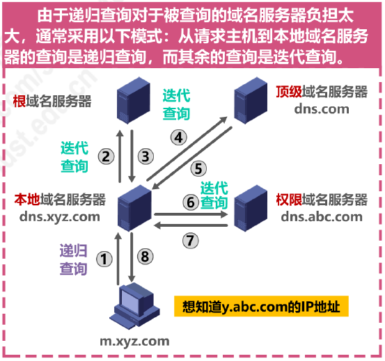

# 概述

- 应用层解决**通过应用进程的交互**来实现特定网络应用的问题 
- 应用层是计算机网络体系结构的**最顶层**，是**设计和建立计算机网络的最终目的**，也是计算机网络中发展最快的部分

# C/S 方式和 P2P 方法

## 客户／服务器（Client / Server，C/S）方式
- 客户和服务器是指通信中所涉及的两个应用进程
- 客户／服务器方式所描述的是进程之间服务和被服务的关系
  - **客户是服务请求方，服务器是服务提供方**
  - **服务器总是处于运行状态，并等待客户的服务请求**；服务器具有固定端口号（例如 HTTP 服务器的默认端口号为80），而运行服务器的主机也具有固定的 IP 地址
- C/S 的网络应用：万维网 WWW、电子邮件、文件传输 FTP
- 基与 C/S 方式的应用服务通常是**服务集中型**的，即应用服务集中在网络中比客户计算机少得多的服务器计算机上
  - 由于一台服务器计算机要为多个客户机提供服务在 C/S 应用中，**常会出现服务器计算机跟不上众多客户机请求的情况**
  - 为此，在 C/S应用中，常用**计算机群集**（或服务器场）构建一个强大的**虚拟服务器**

## 对等（Peer-to-Peer，P2P）方式

- 在 P2P 方式中，**没有固定的服务请求者和服务提供者**，分布在网络边缘各端系统中的应用进程是对等的，被称为对等方。对等方相互之间直接通信，每个对等方既是服务的请求者，又是服务的提供者
- P2P 应用：P2P 文件共享、即时通信、P2P 流媒体、分布式存储
- 基于 P2P 的应用是**服务分散型**的，因为服务不是集中在少数几个服务器计算机中，而是分散在大量对等计算机中，这些计算机井不为服务提供商所有，而是为个人控制的桌面计算机和笔记本电脑，它们通常位于住宅、校园和办公室中
- P2P 方式的最突出特性之一就是它的**可扩展性**。因为系统每增加一个对等方，不仅增  加的是服务的请求者，同时也增加了服务的提供者，**系统性能不会因规模的增大而降低**
- P2P 方式**具有成本上的优势**，因为它通常不需要庞大的服务器设施和服务器带宽。为了降低成本，服务提供商对于将 P2P 方式用于应用的兴趣越来越大

# DHCP 动态主机配置协议

- 动态主机配置协议 DHCP（Dynamic Host Configuration Protocol）提供了一种机制，称为即插即用连网；这种机制**允许一台计算机加入新网络时可自动获取 IP 地址等网络配置信息而不用手工参与**
- DHCP 主要使用以下报文来实现其功能：
  - DHCP DISCOVER：DHCP 发现报文
  - DHCP OFFER：DHCP 提供报文
  - DHCP REQUEST：DHCP 请求报文
  - DHCP ACK：DHCP 确认报文
  - DHCP NACK：DHCP 否认报文
  - DHCP RELEASE：DHCP 释放报文
- DHCP 报文在**运输层使用 UDP 协议封装**
  - DHCP 客户使用的 UDP 端口号为68
  - DHCP 服务器使用的UDP端口号为67
- DHCP 客户在**未获取到 IP 地址时使用地址0.0.0.0**
- 在每一个网络上都设置一个 DHCP 服务器会使 DHCP 服务器的数量太多；因此现在是使每一个网络至少有一个 **DHCP 中继代理（通常是一台路由器）**，它配置了 DHCP 服务器的 IP 地址信息，作为各网络中计算机与 DHCP 服务器的桥梁

# DNS 域名系统

- 域名系统 DNS（Domain Name System）是因特网使用的命名系统，**用于把具有特定含义的主机名，转换为便于机器处理的 IP 地址**
- 因特网采用**层次树状结构的域名结构**
  - `---.三级域名.二级域名.顶级域名`
  - 级别最低的域名写在最左边，级别最高的顶级域名写在最右边
- 顶级域名 TLD（Top Level Domain）分为以下三类：
  - 国家顶级域名 nTLD
  - 通用顶级域名 gTLD
  - 反向域 arpa
- 域名和 IP 地址的映射关系必须保存在域名服务器中，供所有其他应用查询。DNS 使用**分布在各地的域名服务器来实现域名到 IP 地址的转换**
- 域名服务器可以划分为以下四种不同的类型：
  - 根域名服务器
  - 顶级域名服务器
  - 权限域名服务器
  - 本地域名服务器
- 域名解析的过程使用两种域名查询方式：
  - **递归查询**
  
  - **迭代查询**
  
- 为了提高 DNS 的查询效率，并减轻根域名服务器的负荷和减少因特网上的 DNS 查询报文数量，在域名服务器和主机中广泛地使用了**高速缓存**
- 为保持高速缓存中的内容正确，域名服务器**应为每项内容设置计时器并删除超过合理时间的项**
- DNS 报文**使用运输层的 UDP 协议**进行封装，运输层**端口号为53**

# FTP 文件传送协议

- **文件传送协议 FTP**（File Transfer Protocol）是因特网上使用得最广泛的文件传送协议
  - FTP **提供交互式的访问**，允许客户**指明文件的类型与格式**（如指明是否使用 ASCII 码），并允许**文件具有存取权限**（如访问文件的用户必须经过授权，并输入有效的口令）
  - **FTP 屏蔽了各计算机系统的细节，因而适合于在异构网络中任意计算机之间传送文件**
- FTP 客户和服务器之间要建立以下**两个并行的 TCP 连接**：
  - **控制连接**，在整个会话期间**一直保持打开**，用于传送 FTP 相关控制命令
  - **数据连接**，用于文件传输，在每次**文件传输时才建立** ，传输结束就关闭
  - **默认情况下，FTP 使用 TCP 21端口进行控制连接，TCP 20端口进行数据连接**
  - 但是，是否使用 TCP 20端口建立数据连接与传输模式有关，**主动方式使用 TCP 20端口，被动方式由服务器和客户端自行协商决定**


# 电子邮件

- 电子邮件系统采用**客户／服务器方式**，三个主要组成构件：**用户代理**、**邮件服务器**、电子邮件所需的**协议**
  - 用户代理：用户与电子邮件系统的接口，又称为电子邮件客户端软件
  - 邮件服务器：电子邮件系统的基础设施，因特网上所有的 ISP 都有邮件服务器，其功能是发送和接收邮件，同时还要负责维护用户的邮箱
  - 协议包括邮件发送协议（例如 SMTP）和邮件读取协议（例如 POP3）


- 常用的**邮件发送协议**是**简单邮件传送协议 SMTP**
  - 基于 TCP 连接，端口号为25
  - 只能传送 ASCII 码文本
  - 用于用户代理向邮件服务器发送邮件以及邮件服务器之间的邮件发送
- 为解决 SMTP 传送非 ASCII 码文本的问题，提出了**多用途因特网邮件扩展 MIME**


- 常用的**邮件读取协议**有以下两个：
  - **邮局协议 POP3**：非常简单、功能有限的邮件读取协议
    - 用户只能以下载井删除方式或下载井保留方式从邮件服务器下载邮件到用户方计算机
    - **不允许用户在邮件服务器上管理自己的邮件**
  - **因特网邮件访问协议 IMAP**:   功能比 POP3 强大的邮件读取协议
    - **用户在自己的计算机上就可以操控邮件服务器中的邮箱**，就像在本地操控一样，因此 IMAP 是一个联机协议
  - POP3 和 IMAP4 都采用**基于 TCP 连接的客户／服务器方式**，POP3使用端口110，IMAP4 使用端口143
- 基于万维网的电子邮件
  - 通过**浏览器**登录（提供用户名和口令）**邮件服务器万维网网站**就可以撰写、收发、阅读和管理电子邮件
  - 这种工作模式与 IMAP 很类似，不同的是用户计算机无需安装专门的用户代理程序，只需要使用通用的万维网浏览器
  - 这种工作模式在**用户浏览器与邮件服务器网站之间使用 HTTP 协议**，而**邮件服务器之间使用 SMTP 协议**


# WWW 万维网

- 万维网使用**统一资源定位符 URL** 来指明因特网上任何种类的“资源”的位置，`<协议>://<主机>:<端口>/<路径>`
- **万维网的文档**
  - **HTML**（Hyper Text Markup Language）超文本标记语言：使用多种“标签”来描述网页的结构和内容
  - **CSS**（Cascading Style Sheets）层叠样式表：描述网页的样式
  - **JavaScript**（与 Java 无关）：控制网页的行为
- **超文本传输协议 HTTP**（Hyper Text Transfer Protocol）：HTTP 定义了浏览器（即万维网客户进程）如何向万维网服务器请求万维网文档，以及万维网如何把万维网文档传送给浏览器
  - **HTTP/1.0** 采用**非持续连接**方式：每次浏览器请求一个文件都要和服务器建立 TCP 连接，当收到响应后就立即关闭连接
  - **HTTP/1.1** 采用**持续连接**方式：万维网服务器在发送响应后依然保持这条连接，使同一个客户（浏览器）和该服务器可以继续在这条连接上传送后续的 HTTP 请求报文和响应报文


- HTTP 的报文格式：HTTP 是面向文本的，其报文中的每一个字段都是一些 ASCII 码串，且每个字段的长度都是不确定的
- **HTTP 的请求报文格式**


- **HTTP 的响应报文格式**


- **Cookie 是一种对无状态的 HTTP 进行状态化的技术**
- 万维网缓存又称为 **Web 缓存**，用于提高万维网的效率，可位于客户机，也可位于中间系统上，位于中间系统上的 Web 缓存又称为**代理服务器**

# HTTP 协议

> [关于HTTP协议，一篇就够了](https://www.cnblogs.com/ranyonsue/p/5984001.html)

## 简介

- Hyper Text Transfer Protocol（超文本传输协议），用于从万维网服务器传输超文本到本地浏览器的传送协议
- 基于 TCP/IP 通信协议来传递数据
- 属于应用层的面向对象的协议，目前在 WWW 中使用的是 HTTP/1.0 的第六版，HTTP/1.1 的规范化工作正在进行之中
- HTTP 协议工作于客户端-服务端架构：浏览器作为 HTTP 客户端通过 URL 向 HTTP 服务端即 WEB 服务器发送请求；Web 服务器根据接收到的请求后，向客户端发送响应信息

## 主要特点

1. 简单快速：客户向服务器请求服务时，只需传送请求方法和路径
2. 灵活：HTTP 允许传输任意类型的数据对象，传输类型由`Content-Type`加以标记
3. **无连接**：限制每次连接只处理一个请求，服务器处理完客户的请求，并收到客户的应答后，就断开连接
4. **无状态**：HTTP 协议是无状态协议
   - 无状态是指协议对于事务处理没有记忆能力
   - 缺少状态意味着如果后续处理需要前面的信息，则它必须重传，这样可能导致每次连接传送的数据量增大
   - 另一方面，在服务器不需要先前信息时它的应答就较快
5. 支持 B/S 及 C/S 模式

## 请求消息 Request

- 请求行（request line）：说明请求类型,要访问的资源以及所使用的 HTTP 版本
- 请求头部（header）：说明服务器要使用的附加信息，如`Host`指出请求的目的地，`User-Agent`指出浏览器类型，`Content-Type`指出请求数据的类型
- 空行：请求头部后面的空行是必须的
- 请求数据：也叫主体，可以添加任意的其他数据（POST 请求没有请求数据）

## 响应消息 Response

- 状态行：由 HTTP 协议版本号， 状态码， 状态消息三部分组成
- 消息报头：说明客户端要使用的一些附加信息，如`Date`指出生成响应的日期和时间，`Content-Type`指定了 MIME 类型和编码类型
- 空行：消息报头后面的空行是必须的
- 响应正文：服务器返回给客户端的文本信息

## 状态码

> [HTTP状态码](https://www.runoob.com/http/http-status-codes.html)

- 1xx：指示信息--表示请求已接收，继续处理
- 2xx：成功--表示请求已被成功接收、理解、接受
- 3xx：重定向--要完成请求必须进行更进一步的操作
- 4xx：客户端错误--请求有语法错误或请求无法实现
- 5xx：服务器端错误--服务器未能实现合法的请求

常见状态码：

```
200 OK                        //客户端请求成功
400 Bad Request               //客户端请求有语法错误，不能被服务器所理解
401 Unauthorized              //请求未经授权，这个状态代码必须和WWW-Authenticate报头域一起使用 
403 Forbidden                 //服务器收到请求，但是拒绝提供服务
404 Not Found                 //请求资源不存在，eg：输入了错误的URL
500 Internal Server Error     //服务器发生不可预期的错误
503 Server Unavailable        //服务器当前不能处理客户端的请求，一段时间后可能恢复正常
```

## HTTP 请求方法

> HTTP1.0 定义了三种请求方法： GET、POST、HEAD 方法
>
> HTTP1.1 新增了五种请求方法：OPTIONS、PUT、DELETE、TRACE、CONNECT 方法

- GET：请求指定的页面信息，并返回实体主体
- HEAD：类似于 GET 请求，只不过返回的响应中没有具体的内容，用于获取报头
- POST：向指定资源提交数据进行处理请求（例如提交表单或者上传文件）。数据被包含在请求体中。POST请求可能会导致新的资源的建立和/或已有资源的修改
- PUT：从客户端向服务器传送的数据取代指定的文档的内容
- DELETE：请求服务器删除指定的页面
- CONNECT：HTTP/1.1 协议中预留给能够将连接改为管道方式的代理服务器
- OPTIONS：允许客户端查看服务器的性能
- TRACE：回显服务器收到的请求，主要用于测试或诊断

## GET 和 POST 请求的区别

1. GET 提交的数据会放在 URL 之后，以?分割 URL 和传输数据，参数之间以&相连；POST 提交的数据放在 HTTP 包的 Body 中
2. GET 提交的数据大小有限制（因为浏览器对 URL 的长度有限制）；POST 方法提交的数据没有限制
3. POST 的安全性要比 GET 的安全性高：通过 GET 提交数据，用户名和密码将明文出现在 URL 上
4. GET 方式需要使用`Request.QueryString`来取得变量的值；POST 方式通过`Request.Form`来获取变量的值

> POST 不支持复杂数据类型，因为 POST 没有定义传输数据结构的语义和规则
>
> SOAP：是HTTP POST 的一个专用版本，遵循一种特殊的 xml 消息格式，
Content-type设置为: text/xml 任何数据都可以 xml 化

## POST 和 PUT 请求的区别

- POST 请求**不具有幂等性**（idempotent）；PUT 请求**具有幂等性**（idempotent）

## HTTP 工作原理

1. 客户端连接到 Web 服务器
  - 一个 HTTP 客户端，通常是浏览器，与 Web 服务器的 HTTP 端口（默认为80）建立一个 TCP 连接
2. 发送 HTTP 请求
  - 通过TCP 连接，客户端向Web服务器发送一个文本的请求报文
3. 服务器接受请求并返回 HTTP 响应
  - Web服务器解析请求，定位请求资源。服务器将资源复本写到 TCP 连接，由客户端读取
4. 释放连接 TCP 连接
  - 若 Connection 模式为 close，则服务器主动关闭 TCP 连接，客户端被动关闭连接，释放 TCP 连接；若 Connection 模式为 keepalive，则该连接会保持一段时间，在该时间内可以继续接收请求
5. 客户端浏览器解析 HTML 内容
  - 客户端浏览器首先解析状态行，查看表明请求是否成功的状态代码
  - 然后解析每一个响应头，响应头告知以下为若干字节的 HTML 文档和文档的字符集
  - 客户端浏览器读取响应数据 HTML，根据 HTML 的语法对其进行格式化，并在浏览器窗口中显示

在浏览器地址栏键入URL，按下回车之后会经历以下流程：
1. 浏览器向 DNS 服务器请求解析该 URL 中的域名所对应的 IP 地址
2. 解析出 IP 地址后，根据该 IP 地址和默认端口80，和服务器建立 TCP 连接
3. 浏览器发出读取文件的 HTTP 请求，该请求报文作为 TCP 三次握手的第三个报文的数据发送给服务器
4. 服务器对浏览器请求作出响应，并把对应的 HTML 文本发送给浏览器
5. 释放 TCP 连接
6. 浏览器将该 HTML 文本并显示内容