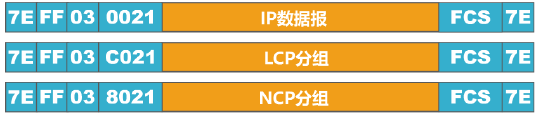
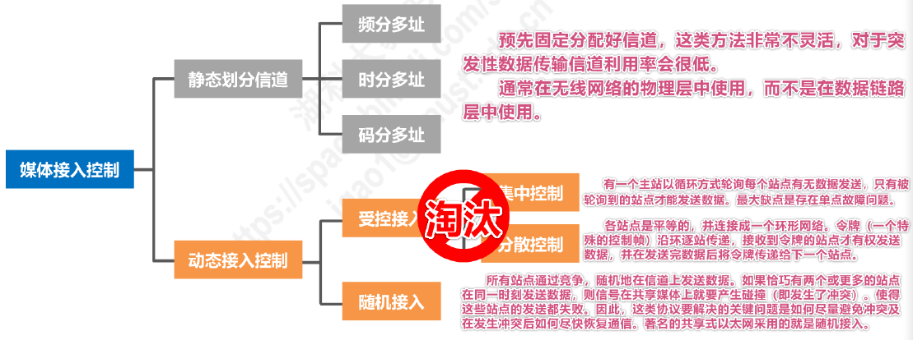

# 基本概念

## 链路与数据链路

- **链路（Link）**：从一个结点到相邻结点的一段物理线路，而中间无任何其他交换结点
- **数据链路（Data Link）**：把实现通信协议的硬件和软件加到链路上，构成数据链路
- 数据链路层是**以帧为单位**传输和处理数据

## 使用点对点信道的三个重要问题

> 针对点对点信道的数据链路层

- 封装成帧

- 差错检测
- 可靠传输：无论发送方发送什么内容，接收方都能接收到什么

## 使用广播信道

- 共享式以太网的媒体接入控制协议 CSMA/CD
- 802.11 局域网的媒体接入控制协议 CSMA/CA

## 数据链路层的互连设备

- 网桥
- 交换机
- 集线器（物理层互连设备）与交换机的区别

# 封装成帧

- 封装成帧：数据链路层给上层交付的协议数据单元（PDU）**添加帧头和帧尾使之成为帧**

## 帧头帧尾

- 帧头帧尾包含重要的控制信息，**作用之一为帧定界**
  - **以太网 V2 的 MAC 帧**通过物理层在**头部加入前导码**
  - **PPP帧**的帧头和帧尾各含有一个字节的**标志位**

## 透明传输

- **透明传输**：**数据链路层对上层交付的传输数据没有任何限制**，仿佛数据链路层不存在
- **面向字节**的链路：使用**字节填充（或称字符填充）**的方法实现透明传输
  - 在协议数据单元内的标志位/转义字符（Data Link Escape，DLE）前添加转义字符
- **面向比特**的链路：使用**比特填充**的方法实现透明传输
  - “零比特填充法”：在协议数据单元内，每`5`个连续`1`后面插入一个比特`0`

## 最大传送单元 MTU

- 为了提高帧的传输效率，帧的数据部分的长度应该尽可能大
- **最大传送单元（Maximum Transfer Unit，MTU）**：每一种数据链路层协议都规定了**帧的数据部分的长度上限**

# 差错检测

- **误码率（Bit Error Rate）**：在一段时间内，传输错误比特占所传输比特总数的比率
- 奇偶校验：在待发送的数据后面添加**1位奇偶校验位**，使整个数据（包括所添加的校验位在内）中“1”的个数为奇数（奇校验）或偶数（偶校验）
- **检错码**只能检测出帧在传输出现了差错，但**不能定位错误，无法纠正错误**

## 循环冗余校验 CRC

- Cyclic Redundancy Check，CRC

1. 收发双方约定好一个**生成多项式 G(x)**
2. 发送方基于待发送的数据和生成多项式计算出差错检测码（**冗余码**），将其添加到待传输数据的后面一起传输
3. 接收方通过生成多项式来计算收到的数据是否产生误码

- 循环冗余校验 CRC 有很好的检错能力，易于用应将实现，被广泛应用于数据链路层

# 可靠传输

## 基本概念

- **不可靠传输**服务：仅仅丢弃有误码的帧，不做其他处理
- **可靠传输**服务：发送端发送什么，接收端就收到什么
- 一般情况下，**有线链路**的误码率较低，**不要求数据链路层**向上提供**可靠**传输服务
- **无线链路**易受干扰，误码率较高，**要求数据链路层**必须先上层提供可靠传输服务
- **可靠传输服务并不局限于数据链路层**，其它各层均可选择实现可靠传输
- 传输差错：**比特差错**、**分组丢失**、**分组失序**、**分组重复**

## 停止-等待协议 SW

### 基本概念

- 停止-等待协议，Stop-and Wait，SW
- ACK： Acknowledge character，确认字符
- NAK： Negative Acknowledge，否认字符

### 注意事项

- 接收端检测到数据分组有误码时，将其丢弃并等待发送方的超时重传，或**给发送方发送 NAK 分组**
- **数据分组编号**：为了让接收方能够判断所收到的数据分组是否重复；由于停止-等待协议的停等特性，**只需1个比特编号即可，即编号0和1**
- **ACK 分组编号**：为了让发送方能够判断收到的 ACK 分组是否重复，**所用比特数量与数据分组相同**
  - 数据链路层一般不会出现 ACK 分组迟到的情况，因此在**数据链路层实现停止-等待协议可以不用给 ACK 分组编号**
- 超时计时器设置的**重传时间**一般选为**略大于“从发送方到接收方的平均往返时间”**
- 自动请求重传（Automatic Repeat reQuest，ARQ）

### 信道利用率

- **当往返时间 RTT 远大于数据帧发送时延$T_D$时（e.g. 卫星链路），信道利用率非常低**
- 若出现重传，则对于传送有用的数据信息而言，信道利用率还要降低

## 回退 N 帧协议 GBN

### 基本概念

- 连续 ARQ 协议
- 滑动窗口协议
- 由于回退 N 帧协议的特性，当通信线路质量不好时，其信道利用率并不比停止-等待协议高

### 发送方

- **发送窗口$W_T$的取值范围：$1<W_T\leq2^n-1$，其中$n$是构成分组序号的比特数量**
  - $W_T=1$：停止-等待协议
  - $W_T>2^n-1$：接收方无法分辨新、旧数据分组
- 发送方可在未收到接收方确认分组的情况下，将序号落在发送窗口内的多个数据分组全部发送出去
- **发送方只有收到对已发送数据分组的确认时，发送窗口才能向前相应滑动**
- 发送方收到多个重复确认时，可在重传计时器超时前尽早开始重传
- **回退 N 帧**：发送方发送窗口内某个已发送的数据分组产生超时重发时，其后续在发送窗口内且已发送的数据分组也必须全部重传

### 接收方

- **接收方的接收窗口尺寸$W_R$的取值范围：$W_R=1$，即接收方只能按序接收数据分组**
- 接收方只接受序号落在接受窗口内且无误码的数据分组，并且将接收窗口向前滑动一个位置，同时给发送方发回相应的确认分组
  - **累计确认**：为减少开销，接收方可以在连续收到多个按序到达且无误码的数据分组后，才针对最后一个数据发送确认分组$ACK_n$
  - 或者可以在自己有数据分组要发送时才对之前按序接收且无误码的数据分组进行捎带确认
- 接收方收到未按序到达的数据分组，除丢弃外，还要对最近按序接收的数据分组进行确认

## 选择重传协议 SR

### 基本概念

- **GBN 的缺点**：GBN 的接收窗口尺寸$W_R$只能为1，一个数据分组的误码会导致后续多个数据分组不能被接收方按序接收而丢弃，造成通信资源浪费
- 选择重传协议（Selective Request，SR）：为了使发送方仅重传出现差错的分组，**接收方不能再采用累积确认**，而需要对每个正确接收到的数据分组进行**逐一确认**

### 发送方

- **发送窗口$W_T$的取值范围：$1<W_T\leq2^{n-1}$，其中$n$是构成分组序号的比特数量**
  - $W_T=1$：停止-等待协议
  - $W_T>2^{n-1}$：接收方无法分辨新、旧数据分组
- 发送方可在未收到接收方确认分组的情况下，将序号落在发送窗口内的多个数据分组全部发送出去
- **发送方只有收到对已发送数据分组的确认时，发送窗口才能向前相应滑动**
- **若收到未按序到达的确认分组时，对其进行记录，以防止其相应数据分组的超时重发，但发送窗口不能向前滑动**

### 接收方

- **接收方的接收窗口尺寸$W_R$的取值范围：$1<W_R\leq W_T$**
  - $W_R=1$：回退 N 帧协议
  - $W_R>W_T$：无意义
- 接收方可接收未按序到达但没有误码且序号落在接收窗口内的数据分组
- 为了使发送方仅重传出现差错的分组，**接收方不能再采用累积确认**，而需要对每个正确接收到的数据分组进行**逐一确认**
- 接收方只有在按序接收数据分组后，接收窗口才能向前相应滑动

# 点对点协议 PPP

## 基本概念

- 点对点协议 PPP（Point-to-Point Protocol）是目前使用最广泛的点对点数据链路层协议
- PPP 协议主要由以下三部分构成：
  - 对各种协议数据包的封装方法（封装成帧）
  - 链路控制协议 LCP：用于建立、配置以及测试数据链路的连接
  - 一套网络控制协议 NCPs：其中的每一个协议支持不同的网络层协议

## 帧格式

- 标志（Flag）字段：PPP 帧的定界符，取值为`0x7E`
- 地址（Address）字段：取值为`0xFF`，预留（目前没有什么作用）
- 控制（Control）字段：取值为`0x03`，预留（目前没有什么作用）
- 协议（Protocol）字段：指明帧的数据部分交送哪个协议处理
  - 取值`0x0021`表示：帧的数据部分为 IP 数据报
  - 取值`0xC021`表示：帧的数据部分为 LCP 分组
  - 取值`0x8021`表示：帧的数据部分为 NCP 分组

- 帧检验序列（Frame Check Sequence）字段：CRC 计算出的校验位

## 透明传输

### 字节填充法

- 发送方的处理
  - 出现的每一个`7E`（PPP 帧的定界符）字节转变成2字节序列`(7D,5E)`
  - 出现的每一个`7D`（转义字符）字节转变成2字节序列`(7D,5D)`
  - 出现的每一个 ASCII 码控制字符（数值小于`0x20`的字符），则在该字符前面插入一个`7D`字节，同时将该字符的编码加上`0x20`
- 接收方的处理
  - 进行**反变换**即可恢复出原来的帧的数据部分

### 比特填充法

- 发送方的处理：对帧的数据数据部分进行扫描（一般由硬件实现），只要发现**5个连续的比特1，则立即填充1个比特0**
- 接收方的处理：对帧的数据数据部分进行扫描（一般由硬件实现），只要发现**5个连续的比特1，则立即删除其后的1个比特0**

## 差错检测

- 接收方每接收发一个 PPP 帧，就进行 CRC 检验
  - 若 CRC 检验正确，接收该帧
  - 反之，丢弃该帧
- **使用 PPP 的数据链路层向上不提供可靠的传输服务**

## 工作状态

# 媒体接入控制 MAC

## 基本概念

- 媒体接入控制（MAC，Medium Access Control）：共享信道中，协调多个发送和接收站点对一个共享传输媒体的占用

- **交换式局域网（e.g. 点对点链路、链路层交换机）在有线领域已完全取代了共享式局域网**
- 由于无线信道的广播特性，**无线局域网仍然使用共享媒体技术**

## 静态划分信道

### 复用与多址

- 复用（Multiplexing）：将单一媒体的频带资源划分为很多子信道，这些子信道之间相互独立，互不干扰，每个子信道只占用该媒体频带资源的一部分
- 多址 / 多点接入（Multiple Access）：处理的是动态分配信道给用户，用户暂时性地占用信道

### 码分复用 CDM

- 码分复用主要用于多址接入，故常用的名称为码分多址（CDMA，Code Division Multiple Access）
- CDMA 的每一个用户在**相同的时间使用相同的频带**、**不同且正交的码型**进行通信，各用户之间不会造成干扰

### CDMA 的码型

- 码片（Chip）：在 CDMA 中，每一个比特时间再划分为 m 个短的间隔，m 的值通常为`64`或`128`
- 使用 CDMA 的每一个站被指派一个**唯一的 m bit 码片序列（Chip Sequence）**
  - 发送**比特1**：发送自己的 **m bit 码片序列**
  - 发送**比特0**：发送自己的 **m bit 码片序列的二进制反码**
- 按照惯例，将码片序列中的`0`写为`-1`，将`1`写为`+1`
- 码片序列的挑选原则
  - 分配给每个站的码片序列必须互不相同，实际常使用伪随机序列
  - 分配给每个站的码片序列必须相互正交（规格化内积为 0）

## 动态随机接入-CSMA / CD

> CSMA / CD 协议曾用于总线结构以太网和双绞线以太网的早期版本
>
> 现在的以太网基于交换机和全双工连接，不会有碰撞，因此没有必要使用 CSMA / CD 协议

### 基本概念

- 载波监听多址接入/碰撞检测（CSMA / CD，Carrier Sense Multiple Access / Collision Detection）
- 多址接入 MA：多个站连接在一条总线上，竞争使用总线
- 载波监听 CS：每一个站在发送帧之前先要检测一下总线上是否有其他站点在发送帧
  -  若检测到**总线空闲96比特时间**，则发送这个帧
  - 若检测到总线忙，则继续检测并**等待总线转为空闲96比特时间**，然后发送该帧
- 碰撞检测 CD：每一个正在发送帧的站边发送边检测碰撞
  - 一旦发现总线上出现碰撞，则立即停止发送，退避一段随机时间后再次发送

### 争用期 / 碰撞窗口

- **争用期 / 碰撞窗口：以太网的端到端往返传播时延$2\tau$**
- **经过争用期这段时间还没有检测到碰撞，才能肯定这次发送不会发生碰撞**
- 在以太网中发送帧的主机越多，端到端往返传播时延越大，发生碰撞的概率就越大，共享式以太网不能连接太多的主机，使用的总线也不能太长

### 最小帧长

- **以太网规定最小帧长为64字节**，即512比特（512比特时间即为争用期）
- **以太网的最小帧长确保了主机可在帧发送完成之前就检测到该帧的发送过程中是否遭遇了碰撞**
  - 若在争用期没有检测到碰撞，那么后续发送的数据就一定不会发生碰撞
  - 若在争用期检测到碰撞，就立即中止发送，此时已发送的数据一定小于64字节，因此**长度小于64字节的帧都是由于碰撞而异常中止的无效帧**

### 截断二进制指数退避算法

- $随机退避时间=争用期2\tau\times随机数r$，其中$r$从离散的整数集合$\{0,1,...,(2^k-1)\}$中随机取出一个，$k=min(重传次数,10)$
- 当重传达16次仍不能成功时，这表明同时发送数据的主机太多以至于连续发生碰撞，则丢弃该帧并向高层报告

### 以太网的信道利用率

### 帧发送流程

### 帧接收流程

## 动态随机接入-CSMA / CA

### 基本概念

- 载波监听多址接入 / 碰撞避免（CSMA / CA，Carrier Sense Multiple Access / Collision Avoidance）
- **802.11 无线局域网在 MAC 层使用 CSMA / CA 协议**，以尽量减小碰撞发生的概率
- **不能使用 CSMA / CD 协议的原因是在无线局域网中无法实现碰撞检测**，在使用 CSMA / CA 协议的同时，还是使用停止-等待协议来实现可靠传输
- 802.11 的 MAC 层标准定义了两种不同的媒体接入控制方式：
  - **分布式协调功能 DCF，默认方式**
  - 点协调功能 PCF，可选方式，实际中较少使用

### 帧间间隔 IFS

- **帧间间隔（IFS，Inter Frame Space）**：802.11 标准规定，所有站点必须在持续监测到信道空闲**一段时间后**才能发送帧
- 常用的帧间间隔：
  - **短帧间间隔 SIFS（$28\mu s$）**：最短的帧间间隔，用于分隔开属于一次对话的各帧（ACK 帧、CTS 帧等）
  - **DCF 帧间间隔 DIFS（$128\mu s$）**：在 DCF 方式中用来发送数据帧和管理帧

### 退避算法

- 在执行退避算法时，站点为退避计时器设置一个随机的退避时间
  - 当退避计时器的时间减小到零时，开始发送数据
  - 当退避计时器的**时间还未减小到零时且信道又转变为忙状态**，这时就**冻结退避计时器的数值**，重新等待**信道变为空闲**，再经过时间 **DIFS** 后，**继续启动退避计时器**

### 信道预约

1. 源站在发送数据帧之前先发送一个短的控制帧，称为**请求发送 RTS（Request To Send）**，其包括源地址、目的地址和**此次通信所需持续时间**
2. 若目的站正确接收 RTS 帧，且媒体空闲，就发送一个响应控制帧，称为**允许发送帧 CTS（Clear To Send）**，其也包括**此次通信所需持续时间**
3. 源站收到 CTS 帧后，再等待时间 SIFS 后，就可以发送其数据帧
4. 若目的站正确接收数据帧，再等待时间 SIFS 后，就向源站发送确认帧 ACK

### 虚拟载波监听

- 除 RTS 帧和 CTS 帧之外，**数据帧也携带通信所需持续时间**
- **站点只要监听到 RTS 帧、CTS 帧或数据帧中的任何一个，就能知道信道被占用的持续时间**，而无需真正监听信道上的信号
- **虚拟载波监听机制能够减少隐蔽站带来的碰撞问题**

# MAC 地址

