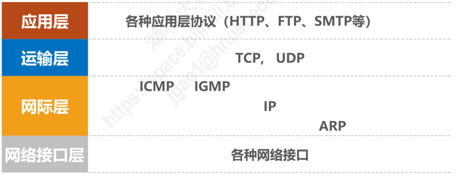
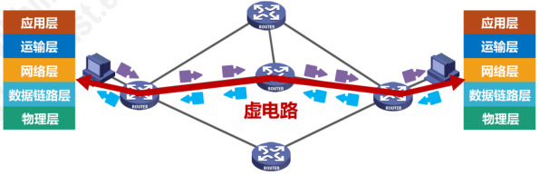
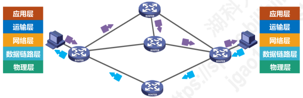
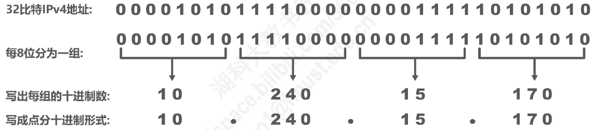
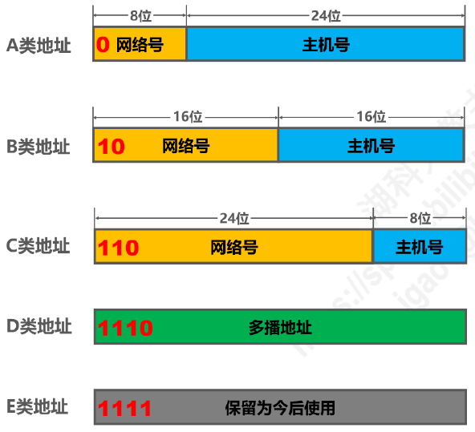
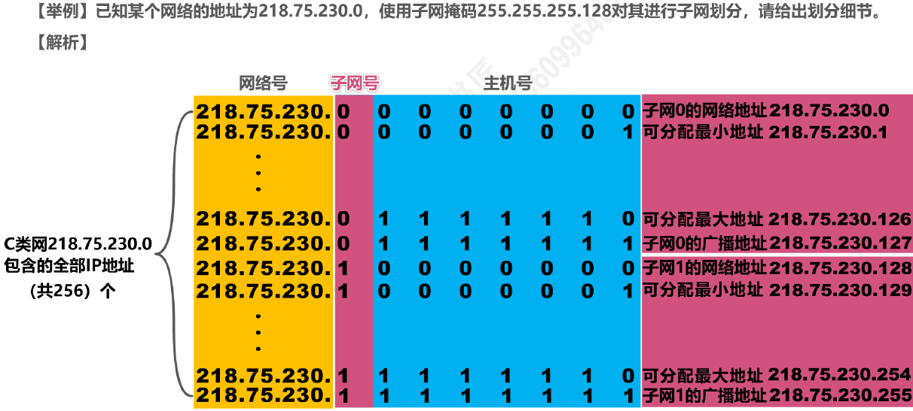
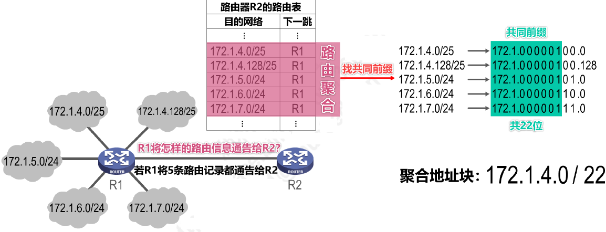
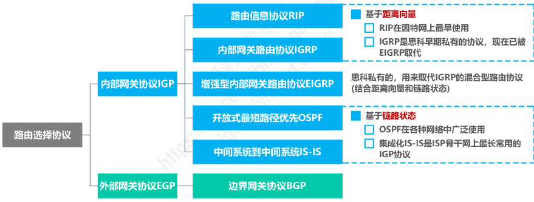
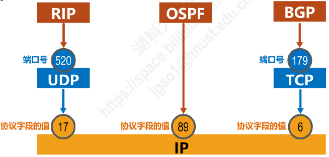
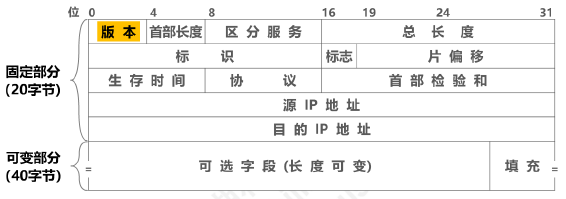

# 网络层概述

- 网络层的主要任务：**实现网络互连**，从而实现数据包在**各网络之间的传输**（主要靠路由器实现）
- 网络层需要解决以下主要问题：
  1. **网络层向运输层提供怎样的服务**（可靠传输 / 不可靠传输）
  2. **网络层寻址问题**
  3. **路由选择问题**
- 因特网使用的是 TCP / IP 协议栈
- TCP / IP 协议栈的网络层使用**网际协议 IP**，它是整个协议栈的核心协议，因此 TCP / IP 协议栈中的网络层常称为**网际层**

# 网络层提供的两种服务

## 面向连接的虚电路

- 可靠通信由**网络**来保证
- **必须建立网络层的连接 —— 虚电路 VC（Virtual Circuit）**
- **通信双方沿着已建立的虚电路发送分组**
- 目的主机的地址仅在连接建立阶段使用，**之后每个分组的首部只需携带一条虚电路的编号**
- 该通信方式可使所发送的**分组最终正确到达接收方（无差错按序到达、不丢失、不重复）**
- **通信结束后，需要释放之前所建立的虚电路**

- **很多广域分组交换网**都使用面向连接的虚电路服务

## 无连接的数据报服务

- 可靠通信由**用户主机**来保证
- **不需要建立网络层连接**
- **每个分组可走不同的路径**
- 每个分组的**首部必须携带目的主机的完整地址**
- 该通信方式所传送的**分组可能误码、丢失、重复和失序**
- 由于**网络本身不提供端到端的可靠传输服务**，使得路由器结构简单、成本低廉
- **因特网**采用该通信方式，即**将复杂的网络处理功能置于因特网的边缘（用户主机和其内部的运输层）**，将相对简单的分组交付功能置于因特网核心
  - **TCP / IP 体系结构的因特网的网际层提供的是简单灵活、无连接的、尽最大能力交付的数据报服务**

## 两种服务的对比

|              | 虚电路服务                                     | 数据报服务                                     |
| ------------ | ---------------------------------------------- | ---------------------------------------------- |
| 思路         | 可靠通信由网络来保证                           | 可靠通信由用户主机来保证                       |
| 连接建立     | 必须建立网络层连接                             | 不需要建立网络层连接                           |
| 终点地址     | 仅在连接建立阶段使用，每个分组使用短的虚电路号 | 每个分组都有终点的完整地址                     |
| 分组转发     | 属于同一条虚电路的分组均按照同一路由进行转发   | 每个分组可走不同的路由                         |
| 结点故障     | 所有通过故障结点的虚电路均不能工作             | 故障结点可能会丢失分组，一些路由可能会发生变化 |
| 分组顺序     | 总是按发送顺序到达                             | 不一定按发送顺序到达                           |
| 服务质量保证 | 可将通信资源提前分配给每一个虚电路，容易实现   | 很难实现                                       |

# IPv4 地址

## 基本概念

- IPv4 地址：因特网上的**每一个主机（或路由器）的每一个接口**分配一个在全世界范围内是**唯一的32比特标识符**
- IPv4 地址的编址方式经历三个阶段
  1. 分类编址
  2. 划分子网
  3. 无分类编制
- IPv4 地址采用**点分十进制表示方法**

## 分类编址

### 五类地址

| 网络类别 | 第一个可指派的网络号 | 最后一个可指派的网络号 | 最大可指派的网络数量 | 每个网络中的最大主机数量 | 不能指派的网络号 |
| -------- | -------------------- | ---------------------- | -------------------- | ------------------------ | ---------------- |
| A        | 1                    | 126                    | $2^{8-1}-2=126$      | $2^{24}-2=16777214$      | 0和127           |
| B        | 128.0                | 191.255                | $2^{16-2}=16384$     | $2^{16}-2=65534$         | 无               |
| C        | 192.0.0              | 223.255.255            | $2^{24-3}=2097152$   | $2^{8}=254$              | 无               |

### 注意事项

- **只有 A 类、B 类、C 类地址可分配给网络中的主机或路由器的各接口**
- **主机号为“全0”的地址为网络地址，不能分配给主机或路由器的各接口**
- **主机号为“全1”的地址为广播地址，不能分配给主机或路由器的各接口**

### 判断技巧

- 根据地址左起第一个十进制数的值，可以判断出网络类别：小于127的为 A 类，128~191的为 B 类，192~223的为 C 类
- 根据网络类别，可找出地址中的网络号部分和主机号部分：A 类地址网络号为左起第一个字节，B 类地址网络号为左起前两个字节，C 类地址网络号为左起前三个字节

### 一般不使用的特殊 IP 地址

| 网络号 | 主机号     | 作为源地址         | 作为目的地址       | 意义                                     |
| ------ | ---------- | ------------------ | ------------------ | ---------------------------------------- |
| 0      | 0          | :heavy_check_mark: | :x:                | 在本网络上的本主机（DHCP 协议）          |
| 0      | host-id    | :heavy_check_mark: | :x:                | 在本网络上的某台主机 host-id             |
| 全1    | 全1        | :x:                | :heavy_check_mark: | 只在本网络上进行广播（各路由器均不转发） |
| net-id | 全1        | :x:                | :heavy_check_mark: | 对 net-id 上的所有主机进行广播           |
| 127    | 非全0或全1 | :heavy_check_mark: | :heavy_check_mark: | 用于本地软件环回测试                     |

## 划分子网

- 为新增网络申请新的网络号会浪费原有网络号中剩余的大量 IP 地址，可以从主机号部分借用一部分比特作为子网号

### 子网掩码

- **32比特的子网掩码可以表明分类 IP 地址的主机号部分被借用了几个比特作为子网号**
  - 子网掩码使用连续的比特1来对应网络号和子网号
  - 子网掩码使用连续的比特0来对应主机号
  - 将划分子网的 **IPv4 地址**与其相应的**子网掩码**进行**逻辑与运算**可得到 IPv4 地址**所在子网的网络地址**

### 划分细节

- 通过一个分类的 IP 地址及其相应的子网掩码，可得到子网划分的细节
  1. 划分出的子网数量
  2. 每个子网可分配的 IP 地址数量
  3. 每个子网的网络地址和广播地址
  4. 每个子网可分配的最小和最大地址

### 默认子网掩码

- **默认的子网掩码：未划分子网的情况下使用的子网掩码**
  - A 类：255.0.0.0
  - B 类：255.255.0.0
  - C 类：255.255.255.0

## 无分类编址

- 划分子网在一定程度上缓解了因特网在发展中遇到的困难，但**数量巨大的 C 类网因其地址空间太小而没有得到充分利用**

### CIDR

- **CIDR：无分类域间路由选择**
- **CIDR 消除传统的 A、B、C 类地址和划分子网的概念**
- CIDR 使用**“斜线记法”**或 CIDR记法，即**在 IPv4 地址后面加上斜线`/`，在斜线后面写上网络前缀所占的比特数量**

- CIDR 实际上是**将网络前缀相同的连续的 IP 地址组成一个“CIDR地址块”**

### 地址块的细节

- 只要知道 CIDR 地址块的任一地址，即可知道改地址块的全部细节
  1. 地址块的最小、最大地址
  2. 地址块中的地址数量
  3. 地址块聚合某类网络（A 类、B 类、C 类）的数量
  4. 地址掩码（或称子网掩码）

### 路由聚合 / 构造超网

- **找共同前缀，得到聚合地址块**

- **网络前缀越长，地址块越小，路由越具体**
- **最长前缀匹配**：若路由器查表转发分组时发现有多条路由可选，则选择网络前缀最长的那条，因为这样的路由更具体

## IPv4 地址的应用规划

| 定长的子网掩码 FLSM（Fixed Length Subnet Mask）        | 变长的子网掩码 VLSM（Variable Length Subnet Mask）           |
| ------------------------------------------------------ | ------------------------------------------------------------ |
| 使用同一个子网掩码开来划分子网                         | 使用不同的子网掩码来划分子网                                 |
| 子网划分方式不灵活：只能划分出$2^n$个子网              | 子网划分方式灵活：可按需分配                                 |
| 每个子网所分配的 IP 地址数量相同，容易造成 IP 地址浪费 | 每个子网所分配的 IP 地址数量可以不同，尽可能减少对 IP 地址的浪费 |

# IP 数据包的发送和转发过程

## 主机发送 IP 数据报

- 判断目的主机是否与自己在同一网络
  - 若在同一网络，则直接交付
  - 若不在同一网络，则属于间接交付，传输给主机所在网络的默认网关（路由器），由默认网关帮忙转发
- **判断方法**
  - 源主机、目的主机的 IP 地址分别与源主机的子网掩码相与得到源主机、目的主机的网络地址，判断两者是否相等
  - 若相等，则处于同一网络；若不相等，则不处于同一网络

## 路由器转发 IP 数据报

- 检查 IP 数据报首部是否出错
  - 若出错，这直接丢弃该 IP 数据报并通告源主机
  - 若没有出错，则进行转发
- 根据 IP 数据报的目的地址在路由表匹配的条目
  - 若找到匹配的条目，则转发给条目中指示的下一跳
  - 若找不到，则丢弃该 IP 数据报并通告源主机
- **路由表匹配方法**
  - IP 数据报首部的目的地址与路由表的地址掩码相与，得到目的网络
  - 根据目的网络匹配条目

# 静态路由配置

- 静态路由配置：用户或网络管理员使用路由器的相关命令给路由器人工配置路由器
  - 人工配置方式简单、开销小，一般只在小规模网络中采用
  - 不能及时适应网络状态（流量、拓扑等）的变化
- 静态路由配置可能出现以下导致产生路由环路的错误
  - 配置错误
  - 聚合了不存在的网络
  - 网络故障
- 路由条目的类型
  - 直连网络
  - 静态路由（人工配置）
  - 动态路由（路由选择协议）
- 特殊的静态路由条目
  - 默认路由（目的网络为0.0.0.0，地址掩码为0.0.0.0）
  - 特定主机路由（目的网络为特定主机的 IP 地址，地址掩码为255.255.255.255）
  - 黑洞路由（下一跳为 null0）

# 路由选择协议

## 概述

- 动态路由选择：路由器通过路由器选择协议自动获取路由信息
  - 比较复杂、开销较大，能较好地适应网络状态的变化
  - 适用于大规模网络
- 因特网所采用的路由选择协议的主要特点
  - 自适应：动态路由选择，能较好地适应网络状态的变化
  - 分布式：路由器之间交换路由信息
  - 分层次：将整个因特网划分为许多较小的自治系统 AS（Autonomous System）
- 常见的路由选择协议

- 路由器基本结构
  - 路由选择部分：路由表（路由表一般仅包含从目的网络到下一跳的映射）
  - 分组转发部分：转发表（转发表从路由表得出）

## RIP 路由信息协议

- **路由信息协议 RIP**（Routing Information Protocol）：要求自治系统 AS 内的每一个路由器都要维护从它自己到 AS 内其它每一个网络的距离记录，称为“距离向量”
- RIP 使用**跳数（HopCount）**作为度量（Metric）来**衡量到达目的网络的距离**
  - 路由器到直连网络的距离定义为1
  - 路由器到非直连网络的距离定义为所经过的路由器数加1
  - 允许一条路径最多只能包含15个路由器。“距离”为16时相当于不可达，因此， RIP 只适用于小型互联网
- RIP 认为**好的路由**就是“距离短”的路由 ，也就是**所通过路由器数量最少的路由**
- 当到达同一目的网络有多条“距离相等”的路由时，进行**等价负载均衡**
- RIP 包含以下三个要点
  - **和谁交换信息**：仅和**相邻路由器**交换信息
  - **交换什么信息**：自己的**路由表**
  - **何时交换信息**：**周期性交换**
- **RIP 的基本工作过程**
  1. 路由器刚开始工作时，只知道自己到直连网络的距离为1
  2. 每个路由器仅和相邻路由器周期性地交换并更新路由信息
  3. 若干次交换和更新后，每个路由器都知道到达本 AS 内各网络的最短距离和下一跳地址，称为收敛
- **RIP 的路由条目的更新规则**
  - 发现了新的网络，添加
  - 到达目的网络，相同下一跳，最新消息，更新
  - 到达目的网络，不同下一跳，新路由优势，更新
  - 到达目的网络，不同下一跳，新路由劣势，不更新
  - 到达目的网络，不同下一跳，等价负载均衡
- **RIP 存在“坏消息传播得慢”的问题**，“坏消息传播得慢”又称为**路由环路**或 **距离无穷计数**问题 ，这是距离向量算法的固有问题，**措施**：
  - **限制最大路径距离**为15 (16表示不可达）
  - 当路由表发生变化时就立即发送更新报文（即**触发更新** ) ， 而不仅是周期性发送
  - 让路由器记录收到某特定路由信息的接口，而不让同一路由信息再通过此接口向反方向传送（即**水平分割**)

## OSPF 开放最短路径优先

- **开放最短路径优先 OSPF（Open Shortest Path First）**，是为克服RIP的缺点在1989年开发出来的
  - “开放”表明 OSPF 协议不是受某一家厂商控制，而是**公开发表**的
  - “最短路径优先”是因为使用了 Dijkstra 提出的**最短路径算法 SPF**
- OSPF 是**基于链路状态**的，而不像 RIP 是基于距离向量的
- OSPF 采用 SPF 算法计算路由，从算法上保证了**不会产生路由环路**
- OSPF **不限制网络规模**，更新效率高，**收敛速度快**
- 链路状态是指本路由器都**和哪些路由器相邻**，以及相应**链路的代价（cost）**
  - “代价”用来表示费用、距离、时延、带宽，等等；这些都由网络管理人员来决定
- 使用 OSPF 的每个路由器都会产生**链路状态通告 LSA（Link State Advertisement）**，LSA 中包含以下内容
  - 直连网络的链路状态信息
  - 邻居路由器的链路状态信息
- LSA 被封装在**链路状态更新分组 LSU**中 ，采用**洪泛**法发送
- 使用 OSPF 的每个路由器都有一个**链路状态数据库 LSDB**，用于存储 LSA
- 通过各路由器洪泛发送封装有自己 LSA 的 LSU 分组，各路由器的 LSDB 最终将达到一致
- 使用 OSPF 的各路由器**基于 LSDB 进行最短路径优先 SPF 计算**，构建出各自到达其他各路由器的最短路径，即构建各自的路由表
- **OSPF有以下五种分组类型**
  - **问候** (Hello) 分组
  - **数据库描述** (Database Description) 分组
  - **链路状态请求** (Link State Request) 分组
  - **链路状态更新** (Link State Update) 分组
  - **链路状态确认** (Link  State  Acknowledgment) 分组
- OSPF 在多点接入网络中路由器邻居关系的建立
  - 选举**指定路由器DR**（designated router）和**备用的指定路由器**BDR（backup designated router）
  - **所有的非 DR/BDR 只与 DR/BDR 建立邻居关系**
  - 非 DR/BDR 之间通过 DR/BDR 交换信息
- 为了使 OSPF 能够用于规模很大的网络，OSPF 把一个自治系统再划分为若干个更小的范围，叫做**区域（Area）**
  - 划分区域的好处：**把利用洪泛法交换链路状体信息的范围局限于每一个区域而不是整个自治系统**， 减少整个网络上的通信量

## BGP 边界网关协议

- 外部网关协议 EGP（如：边界网关协议 BGP）
  - 在不同自治系统内，度量路由的代价（距离，带宽，费用等）可能不同，使用“代价”作为度量来寻找最佳路由是不可行的
  - BGP 只能是力求寻找一条能够到达目的网络且比较好的路由，而并非要寻找一条最佳路由
- 在配置 BGP 时，每个自治系统的管理员要选择至少一个路由器作为该自治系统的**“BGP 发言人”**
- 不同自治系统的 BGP 发言人要交换路由信息， 首先必须建立 **TCP 连接**，端口号为179
  - 在此 TCP 连接上交换 BGP 报文以建立 BGP 会话
  - 利用 BGP 会话**交换路由信息**（例如，增加新的路由，或撤销过时的路由，以及报告出错的情况等）
  - 使用 TCP 连接交换路由信息的两个BGP发言人，彼此称为对方的**邻站** （neighbor）或**对等站**（peer）
- BGP 发言人除了运行 BGP 外， 还必须运行自己所在自治系统所使用的内部网关协议 IGP（例如 OSPF 或 RIP）
- BGP 发言人**交换网络可达性的信息**（要到达某个网络所要经过的一系列自治系统）
- 当 BGP 发言人互相交换了网络可达性的信息，各 BGP 发言人就**根据**所采用的**策略**从收到的路由信息中**找出到达各自治系统的较好的路由**，也就是构造出树形结构、**不存在回路的自治系统连通图**
- BGP 适用于多级结构的因特网
- BGP-4 有以下四种报文
  - **OPEN（打开）报文**： 用来与相邻的另一个 BGP 发言人建立关系， 使通信初始化
  - **UPDATE（更新）报文**： 用来通告某一路由的信息以及列出要撤销的多条路由
  - **KEEPALIVE（保活）报文**： 用来周期性地证实邻站的连通性
  - **NOTIFICATION（通知）报文**： 用来发送检测到的差错
- **直接封装 RIP、OSPF、BGP 报文的协议分别是：UDP、IP、TCP**

# IPv4 数据报的首部格式

- 版本：占4比特，表示IP协议的版本，通信双方使用的 IP 协议的版本必须一致
- 首部长度：占4比特，表示 IP 数据报首部的长度。该字段的取值以4字节为单位
  - 最小十进制取值为5，表示 IP 数据报首部只有20字节固定部分
  - 最大十进制取值为15，表示 IP 数据报首部包含20字节固定部分和最大40字节可变部分
- 可选字段：长度从1个字节到40个字节不等，用来支持排错、测量及安全等措施
  - 可选字段增加了 IP 数据报的功能 ，但这也使得 IP 数据报的首部长度成为可变的，这增加了每一个路由器处理 IP 数据报的开销
  - 实际上可选字段很少被使用
- 填充字段：确保首部长度为4字节的整数倍， 使用全0进行填充
- 区分服务：占8比特，用来获得更好的服务
  - 只有在使用区分服务时，该字段才起作用
  - 一般情况下都不使用该字段。
- 总长度：占16比特，表示 IP 数据报的总长度（首部＋数据载荷） 
  - 最大取值为十进制的65535，以字节为单位
- 标识：占16比特，属于同一个数据报的各分片数据报应该具有相同的标识
  - IP 软件维持一个计数器，每产生一个数据报，计数器值加1，并将此值赋给标识字段
- 标志：占3比特，各比特含义如下
  - DF位：1表示不允许分片； 0表示允许分片
  - MF位：1表示“后面还有分片”；0表示“这是最后一个分片”
  - 保留位：必须为0
- 片偏移：占13比特，指出分片数据报的数据载荷部分偏移其在原数据报的位置有多少个单位，片偏移以8个字节为单位
- 生存时间（TTL）：占8比特，表示 IP 数据报的生存时间
- 协议：占8比特，指明 IPv4 数据报的数据部分是何种协议数据单元。常用的一些协议和相应的协议字段值如下：

| 协议名称   | ICMP | IGMP | TCP  | UDP  | IPv6 | OSPF |
| ---------- | ---- | ---- | ---- | ---- | ---- | ---- |
| 协议字段值 | 1    | 2    | 6    | 17   | 41   | 89   |

- 首部检验和：占16比特，用来检测首部在传输过程中是否出现差错。比 CRC检验码简单，称为因特网检验和
  - 由于 IP 层本身井不提供可靠传输的服务，井且计算首部校验和是一项耗时的操作，因此在 IPv6 中，路由器不再计算首部校验和，从而更快转发 IP 数据报
- 源 IP 地址和目的 IP 地址：各占32比特，用来填写发送该 IP 数据报的源主机的 IP 地址和接收该 IP 数据报的目的主机的 IP 地址

# ICMP 网际控制报文协议

- 为了更有效地转发 IP 数据报和提高交付成功的机会，在网际层使用了网际控制报文协议 ICMP（lnternet Control Message Protocol）
- 主机或路由器使用 ICMP 来发送**差错报告报文**和**询问报文**
- **ICMP 报文被封装在 IP 数据报**中发送
- ICMP 差错报告报文共有以下五种：
  - 终点不可达
  - 源点抑制
  - 时间超过
  - 参数问题
  - 改变路由（重定向）
- 以下情况**不应发送 ICMP 差错报告报文**：
  - 对 ICMP 差错报告报文不再发送 ICMP 差错报告报文
  - 对第一个分片的数据报片的所有后续数据报片都不发送 ICMP 差错报告报文
  - 对具有多播地址的数据报都不发送 ICMP 差错报告报文
  - 对具有特殊地址（如127.0.0.0或0.0.0.0)	的数据报不发送 ICMP 差错报告报文
- 常用的 **ICMP 询间报文**有以下两种：
  - 回送请求和回答
  - 时间戳请求和回答
- ICMP 应用：
  - 分组网间探测 PING
  - 跟踪路由 traceroute

# VPN 与 NAT

## VPN 虚拟专用网

- **虚拟专用网 VPN**（Virtual Private Network)：**利用公用的因特网作为本机构各专用网之间的通信载体**，这样的专用网又称为虚拟专用网
- **内联网 VPN**：同一机构内不同部门的内部网络所构成的虚拟专用网 VPN 又称为内联网 VPN
- VPN 要保证传输数据的安全性，会将原始的**内部数据报进行加密**，然后再将其封装成为在因特网上发送到的外部数据报
- **外联网 VPN**：有时一个机构的 VPN 需要有某些外部机构（通常就是合作伙伴）参加进来，这样的 VPN 就称为外联网 VPN
- **远程接入 VPN**：在外地工作的员工需要访问公司内部的专用网络时，只要在任何地点接入 到因特网，运行驻留在员工 PC 中的 VPN 软件，在员工的 PC 和公司的主机之间建立 VPN 隧道，即可访问专用网络中的资源， 这种 VPN 称为 远程接入 VPN

> 专用（私有）地址：
> 
> 10.0.0.0-10.255.255.255(10/8 地址块）
> 
> 172.16.0.01-72.31.255.255(172.16/12 地址块）
> 
> 192.168.0.0-192.168.255.255(192.168/16 地址块）

## NAT 网络地址转换

- 网络地址转换 NAT（Net work Address Translation）
- 由于 IP 地址的紧缺，**虚拟专用网中的各主机所分配地址应该是本机构可自由分配的专用地址**，而不是需要申请的、在因特网上使用的公有地址
- 1994年提出了一种网络地址转换 **NAT 的方法再次缓解了 IP 地址空间耗尽的问题**
- NAT 能使大量使用内部专用地址的专用网络用户共享少量外部全球地址来访问因特网上的主机和资源
- **网络地址与端口号转换 NAPT**（Network Address and Port Translation）：将端口号和IP地址一起进行转换的技术
  - 由于绝大多数的网络应用都是使用运输层协议 TCP 或 UDP 来传送数据，因此可以**利用运输层的端口号和 IP 地址一起进行转换**
  - 用**一个全球 IP地址就可以使多个拥有本地地址的主机同时和因特网上的主机进行通信**
- 对于一些 P2P 网络应用，需要外网主机主动与内网主机进行通信， 在通过 NAT 时会遇到问题 ，需要网络应用自己使用一些特殊的 NAT 穿越技术来解决问题
- 由于 **NAT 对外网屏蔽了内网主机的网络地址，能为内网的主机提供一定的安全保护**