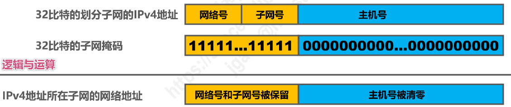

# 网络层概述

- 网络层的主要任务：**实现网络互连**，从而实现数据包在**各网络之间的传输**（主要靠路由器实现）
- 网络层需要解决以下主要问题：
  1. **网络层向运输层提供怎样的服务**（可靠传输 / 不可靠传输）
  2. **网络层寻址问题**
  3. **路由选择问题**
- 因特网使用的是 TCP / IP 协议栈
- TCP / IP 协议栈的网络层使用**网际协议 IP**，它是整个协议栈的核心协议，因此 TCP / IP 协议栈中的网络层常称为**网际层**

# 网络层提供的两种服务

## 面向连接的虚电路

- 可靠通信由**网络**来保证
- **必须建立网络层的连接 —— 虚电路 VC（Virtual Circuit）**
- **通信双方沿着已建立的虚电路发送分组**
- 目的主机的地址仅在连接建立阶段使用，**之后每个分组的首部只需携带一条虚电路的编号**
- 该通信方式可使所发送的**分组最终正确到达接收方（无差错按序到达、不丢失、不重复）**
- **通信结束后，需要释放之前所建立的虚电路**

- **很多广域分组交换网**都使用面向连接的虚电路服务

## 无连接的数据报服务

- 可靠通信由**用户主机**来保证
- **不需要建立网络层连接**
- **每个分组可走不同的路径**
- 每个分组的**首部必须携带目的主机的完整地址**
- 该通信方式所传送的**分组可能误码、丢失、重复和失序**
- 由于**网络本身不提供端到端的可靠传输服务**，使得路由器结构简单、成本低廉
- **因特网**采用该通信方式，即**将复杂的网络处理功能置于因特网的边缘（用户主机和其内部的运输层）**，将相对简单的分组交付功能置于因特网核心
  - **TCP / IP 体系结构的因特网的网际层提供的是简单灵活、无连接的、尽最大能力交付的数据报服务**

## 两种服务的对比

|              | 虚电路服务                                     | 数据报服务                                     |
| ------------ | ---------------------------------------------- | ---------------------------------------------- |
| 思路         | 可靠通信由网络来保证                           | 可靠通信由用户主机来保证                       |
| 连接建立     | 必须建立网络层连接                             | 不需要建立网络层连接                           |
| 终点地址     | 仅在连接建立阶段使用，每个分组使用短的虚电路号 | 每个分组都有终点的完整地址                     |
| 分组转发     | 属于同一条虚电路的分组均按照同一路由进行转发   | 每个分组可走不同的路由                         |
| 结点故障     | 所有通过故障结点的虚电路均不能工作             | 故障结点可能会丢失分组，一些路由可能会发生变化 |
| 分组顺序     | 总是按发送顺序到达                             | 不一定按发送顺序到达                           |
| 服务质量保证 | 可将通信资源提前分配给每一个虚电路，容易实现   | 很难实现                                       |

# IPv4 地址

## 基本概念

- IPv4 地址：因特网上的**每一个主机（或路由器）的每一个接口**分配一个在全世界范围内是**唯一的32比特标识符**
- IPv4 地址的编址方式经历三个阶段
  1. 分类编址
  2. 划分子网
  3. 无分类编制
- IPv4 地址采用**点分十进制表示方法**

## 分类编址

### 五类地址

| 网络类别 | 第一个可指派的网络号 | 最后一个可指派的网络号 | 最大可指派的网络数量 | 每个网络中的最大主机数量 | 不能指派的网络号 |
| -------- | -------------------- | ---------------------- | -------------------- | ------------------------ | ---------------- |
| A        | 1                    | 126                    | $2^{8-1}-2=126$      | $2^{24}-2=16777214$      | 0和127           |
| B        | 128.0                | 191.255                | $2^{16-2}=16384$     | $2^{16}-2=65534$         | 无               |
| C        | 192.0.0              | 223.255.255            | $2^{24-3}=2097152$   | $2^{8}=254$              | 无               |

### 注意事项

- **只有 A 类、B 类、C 类地址可分配给网络中的主机或路由器的各接口**
- **主机号为“全0”的地址为网络地址，不能分配给主机或路由器的各接口**
- **主机号为“全1”的地址为广播地址，不能分配给主机或路由器的各接口**

### 判断技巧

- 根据地址左起第一个十进制数的值，可以判断出网络类别：小于127的为 A 类，128~191的为 B 类，192~223的为 C 类
- 根据网络类别，可找出地址中的网络号部分和主机号部分：A 类地址网络号为左起第一个字节，B 类地址网络号为左起前两个字节，C 类地址网络号为左起前三个字节

### 一般不使用的特殊 IP 地址

| 网络号 | 主机号     | 作为源地址         | 作为目的地址       | 意义                                     |
| ------ | ---------- | ------------------ | ------------------ | ---------------------------------------- |
| 0      | 0          | :heavy_check_mark: | :x:                | 在本网络上的本主机（DHCP 协议）          |
| 0      | host-id    | :heavy_check_mark: | :x:                | 在本网络上的某台主机 host-id             |
| 全1    | 全1        | :x:                | :heavy_check_mark: | 只在本网络上进行广播（各路由器均不转发） |
| net-id | 全1        | :x:                | :heavy_check_mark: | 对 net-id 上的所有主机进行广播           |
| 127    | 非全0或全1 | :heavy_check_mark: | :heavy_check_mark: | 用于本地软件环回测试                     |

## 划分子网

- 为新增网络申请新的网络号会浪费原有网络号中剩余的大量 IP 地址，可以从主机号部分借用一部分比特作为子网号

### 子网掩码

- **32比特的子网掩码可以表明分类 IP 地址的主机号部分被借用了几个比特作为子网号**
  - 子网掩码使用连续的比特1来对应网络号和子网号
  - 子网掩码使用连续的比特0来对应主机号
  - 将划分子网的 **IPv4 地址**与其相应的**子网掩码**进行**逻辑与运算**可得到 IPv4 地址**所在子网的网络地址**

### 划分细节

- 通过一个分类的 IP 地址及其相应的子网掩码，可得到子网划分的细节
  1. 划分出的子网数量
  2. 每个子网可分配的 IP 地址数量
  3. 每个子网的网络地址和广播地址
  4. 每个子网可分配的最小和最大地址

### 默认子网掩码

- **默认的子网掩码：未划分子网的情况下使用的子网掩码**
  - A 类：255.0.0.0
  - B 类：255.255.0.0
  - C 类：255.255.255.0

## 无分类编址

- 划分子网在一定程度上缓解了因特网在发展中遇到的困难，但**数量巨大的 C 类网因其地址空间太小而没有得到充分利用**

### CIDR

- **CIDR：无分类域间路由选择**
- **CIDR 消除传统的 A、B、C 类地址和划分子网的概念**
- CIDR 使用**“斜线记法”**或 CIDR记法，即**在 IPv4 地址后面加上斜线`/`，在斜线后面写上网络前缀所占的比特数量**

- CIDR 实际上是**将网络前缀相同的连续的 IP 地址组成一个“CIDR地址块”**

### 地址块的细节

- 只要知道 CIDR 地址块的任一地址，即可知道改地址块的全部细节
  1. 地址块的最小、最大地址
  2. 地址块中的地址数量
  3. 地址块聚合某类网络（A 类、B 类、C 类）的数量
  4. 地址掩码（或称子网掩码）

### 路由聚合 / 构造超网

- **找共同前缀，得到聚合地址块**

- **网络前缀越长，地址块越小，路由越具体**
- **最长前缀匹配**：若路由器查表转发分组时发现有多条路由可选，则选择网络前缀最长的那条，因为这样的路由更具体

## IPv4 地址的应用规划

| 定长的子网掩码 FLSM（Fixed Length Subnet Mask）        | 变长的子网掩码 VLSM（Variable Length Subnet Mask）           |
| ------------------------------------------------------ | ------------------------------------------------------------ |
| 使用同一个子网掩码开来划分子网                         | 使用不同的子网掩码来划分子网                                 |
| 子网划分方式不灵活：只能划分出$2^n$个子网              | 子网划分方式灵活：可按需分配                                 |
| 每个子网所分配的 IP 地址数量相同，容易造成 IP 地址浪费 | 每个子网所分配的 IP 地址数量可以不同，尽可能减少对 IP 地址的浪费 |

