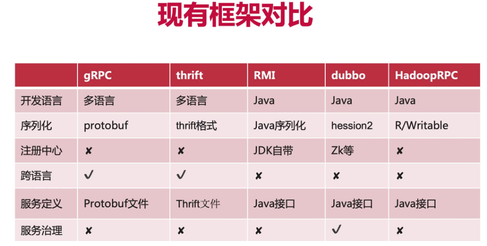
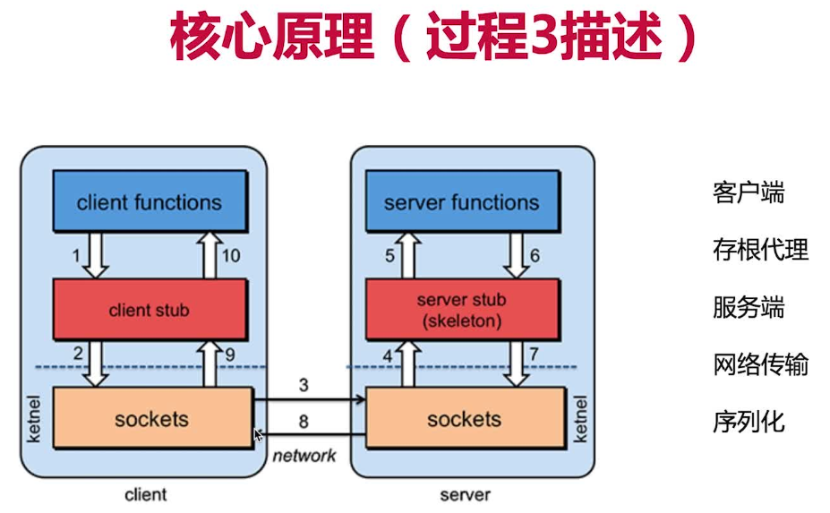
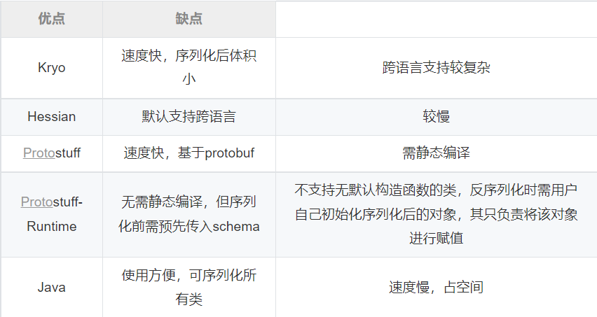

# myRPC 项目介绍

- 基于 Nacos 实现的 RPC 框架，网络传输实现了基于 Java 原生 Socket 和 Netty 版本，并且实现了多种序列化和负载均衡算法
- 整体架构分为三个部分：
  1. 服务端是服务提供者，对外暴露服务
  2. 客户端是服务消费者，调用远程服务
  3. Nacos 注册中心，负责服务注册和发现

# **RPC**

## RPC 是什么

- RPC（Remote Procedure Call）：远程过程调用，它是一种通过网络从远程计算机程序上请求服务，而不需要了解底层网络技术的协议。
- 比如两个不同的服务 A、B 部署在两台不同的机器上，那么服务 A 如果想要调用服务 B 中的某个方法该怎么办呢？使用 *HTTP请求* 当然可以，但是可能会比较慢而且一些优化做的并不好。 
- RPC 的出现就是为了解决这个问题，**让分布式或者微服务系统中不同服务之间的调用像本地调用一样简单**

## 业界常用的 RPC 框架

	
RPC框架

	

- **Dubbo:** Dubbo 是阿里巴巴公司开源的一个高性能优秀的服务框架，使得应用可通过高性能的 RPC 实现服务的输出和输入功能，可以和 Spring框架无缝集成。目前 Dubbo 已经成为 Spring Cloud Alibaba 中的官方组件
- **gRPC** ：gRPC 是可以在任何环境中运行的高性能RPC框架。它可以通过可插拔的支持来有效地连接数据中心内和跨数据中心的服务，以实现负载平衡，跟踪，运行状况检查和身份验证。它也适用于分布式计算的最后一英里，以将设备，移动应用程序和浏览器连接到后端服务
- **Hessian：** Hessian是一个轻量级的 remoting-on-http 工具，使用简单的方法提供了 RMI 的功能。 相比 WebService，Hessian 更简单、快捷。采用的是二进制 RPC协议，因为采用的是二进制协议，所以它很适合于发送二进制数据

## RPC 简要原理

	
RPC原理图

	

1. 服务消费方（client）调用以本地调用方式调用服务
2. 客户端存根（client stub）接收到调用后负责将方法、参数等组装成能够进行网络传输的消息体
3. 客户端存根（client stub）找到服务地址，并将消息发送到服务端
4. 服务端存根（server stub）收到消息后进行解码
5. 服务端存根（server stub）根据解码结果调用本地（server）的服务
6. 本地（server）服务执行并将结果返回给服务端存根（server stub）
7. 服务端存根（server stub）将返回结果打包成消息并发送至消费方
8. 客户端存根（client stub）接收到消息，并进行解码
9. 服务消费方（client）得到最终结果

## RPC 组成部分

- 客户端和服务端建立网络连接模块( **server**模块、**client**模块 )
- 服务端**处理请求模块**
- **协议**模块
- **序列化**和**反序列**模块

## 设计 RPC 需要考虑的问题

- **客户端**和**服务端如何建立网络连接**？
- **服务端**如何**处理请求**？
- **数据传输**采用什么**协议**？
- **数据**该如何**序列化**和**反序列化**？

## 为什么用 RPC，不用 HTTP

- 首先需要指正，这两个并不是并行概念。RPC 是一种**设计**，就是为了解决**不同服务之间的调用问题**，完整的 RPC 实现一般会包含有 **传输协议** 和 **序列化协议** 这两个

- HTTP 是一种传输协议，RPC 框架完全可以使用 HTTP 作为传输协议，也可以直接使用 TCP，使用不同的协议一般也是为了适应不同的场景

- 使用 TCP 和使用 HTTP 各有优势：

  - **总结**：
    - RPC 的 TCP 方式主要用于公司内部的服务调用，性能消耗低，传输效率高
    - HTTP 主要用于对外的异构环境，浏览器接口调用，APP接口调用，第三方接口调用等

  - **传输效率**：
    - TCP，通常自定义上层协议，可以让请求报文体积更小 
    - HTTP：如果是基于HTTP 1.1 的协议，请求中会包含很多无用的内容
  - **性能消耗**，主要在于序列化和反序列化的耗时：
    - TCP，可以基于各种序列化框架进行，效率比较高
    - HTTP，大部分是通过 json 来实现的，字节大小和序列化耗时都要更消耗性能
  - **跨平台**：
    - TCP：通常要求客户端和服务器为统一平台
    - HTTP：可以在各种异构系统上运行

# 注册中心

## 注册中心是怎么做的

- 用 Nacos 作为注册中心，自定义了 NacosUtils 工具类
  1. 通过 NamingFactory 创建 NamingService 连接 Nacos
  2. namingService 提供了两个方法
     - registerInstance 方法，可以直接向 Nacos 注册服务
     - getAllInstances 方法，可以获得提供某个服务的所有提供者的列表

- **服务注册**：将服务的名称和地址注册进服务注册中心
  1. 核心是 registerInstance 方法，可以直接向 Nacos 注册服务
- **服务发现**：根据服务名称查找服务实体（调用地址）
  1. getAllInstances 方法，返回该服务的信息列表
  2. 负载均衡
- **服务自动注销**：服务端关闭时，自动地注销 Nacos 中对应的服务信息
  1. 把注销服务的方法写到关闭系统的钩子方法里
  2. 注销服务的核心是调用 namingService 的 deregisterInstance 方法
  3. 新建一个类，ShutdownHook，自定义方法 addClearAllHook 中，用到 Runtime 对象
  4. Runtime 对象是 JVM 虚拟机的运行时环境，调用其 addShutdownHook 方法增加一个钩子函数，创建一个新线程调用 clearRegistry 方法完成注销工作。这个钩子函数会在 JVM 关闭之前被调用
- **服务自动注册**：基于注解进行服务的自动注册
  1. 定义两个注解：Service 和 ServiceScan
  2. @Service 放在一个类上，**标识这个类提供一个服务**。Service 注解的值定义为该服务的名称，默认值是该类的完整类名
  3. @ServiceScan 放在启动的入口类上（main 方法所在的类），标识服务的扫描的包的范围，ServiceScan 的值定义为扫描范围的根包，默认值为入口类所在的包，扫描时会**扫描该包及其子包下所有的类，找到标记有 Service 的类，并注册**
  4. 首先需要获得要扫描的包的范围，就需要获取到 ServiceScan 注解的值，这个注解是加在启动类上的，通过调用栈，main 方法一定位于调用栈的最底端，用于获取 main 所在的类，通过 Class 对象的 isAnnotationPresent 方法来判断该类是否有 ServiceScan 注解；如果有，通过`startClass.getAnnotation(ServiceScan.class).value();` 获取注解的值
  5. 当获得扫描的范围后，就可以通过`ReflectUtil.getClasses(basePackage)` 获取到所有的 Class 了，逐个判断是否有 Service 注解，如果有的话，通过反射创建该对象，并且调用 publishService 注册即可

## 注册中心需要哪些条件？如何设计？

## 负载均衡

- 从 Nacos 获取到的是所有提供这个服务的服务端信息列表，就需要从中选择一个
- **随机算法** Random，就是随机选一个
- **转轮算法**，按照顺序依次选择第一个、第二个、第三个，index 就表示当前选到了第几个服务器，并且每次选择后都会自增一
- 负载均衡策略，也可以在创建客户端时指定，例如无参构造 NettyClient 时就用默认的策略，也可以有参构造传入策略

## 心跳检测

- Netty 提供了 `IdleStateHandler` 类专门用于处理心跳
- 客户端、服务端都添加 IdleStateHandler 心跳检测处理器，并添加自定义处理 Handler 类实现userEventTriggered() 方法作为超时事件的逻辑处理
- 对于客户端
  - 设定IdleStateHandler心跳检测每5秒进行一次写检测，
  - 如果5秒内 write() 方法未被调用则触发一次userEventTriggered()方法
  - 实现客户端每五秒向服务端发送一次消息，用于心跳检测的请求包
- 对于服务端
  - 设定IdleStateHandler心跳检测每30秒进行一次读检测
  - 如果30秒内ChannelRead()方法未被调用则触发一次userEventTriggered()方法
  - 表示长时间未收到心跳包，断开连接

## Nacos 与 Zookeeper 的区别

# **Java 方面**

## 调用如何在客户端无感（动态代理）

- 基于动态代理生成代理对象，当调用代理对象的方法时，由代理进行相关信息（方法、参数等）的组装并发送到服务器进行远程调用，并由代理接收调用结果并返回

## 动态代理和静态代理的区别

- 静态代理的代理对象和被代理对象在代理之前就已经确定，它们都实现相同的接口或继承相同的抽象类。静态代理模式一般由业务实现类和业务代理类组成，业务实现类里面实现主要的业务逻辑，业务代理类负责在业务方法调用的前后作一些你需要的处理，以实现业务逻辑与业务方法外的功能解耦，减少了对业务方法的入侵。静态代理又可细分为：基于继承的方式和基于聚合的方式实现
- 静态代理模式的代理类，只是实现了特定类的代理，代理类对象的方法越多，你就得写越多的重复的代码。动态代理就可以动态的生成代理类，实现对不同类下的不同方法的代理
- JDK 动态代理是利用反射机制生成一个实现代理接口的匿名类，在调用业务方法前调用`InvocationHandler` 处理。代理类必须实现 `InvocationHandler` 接口，并且，JDK 动态代理只能代理实现了接口的类

## JDK 动态代理的步骤

1. 编写需要被代理的类和接口
2. 编写代理类，需要实现 `InvocationHandler` 接口，重写 `invoke()` 方法；
3. 使用`Proxy.newProxyInstance(ClassLoader loader, Class<?>[] interfaces, InvocationHandler h)`动态创建代理类对象，通过代理类对象调用业务方法

## 如果想代理没有实现接口的对象

- CGLIB 框架实现了对无接口的对象进行代理的方式。JDK 动态代理是基于接口实现的，而 CGLIB 是基于继承实现的。它会对目标类产生一个代理子类，通过方法拦截技术对过滤父类的方法调用。代理子类需要实现 `MethodInterceptor` 接口。
- CGLIB 底层是通过 asm 字节码框架实时生成类的字节码，达到动态创建类的目的，效率较 JDK 动态代理低。Spring 中的 AOP 就是基于动态代理的，如果被代理类实现了某个接口，Spring 会采用 JDK 动态代理，否则会采用 CGLIB

## Java对象是怎么在网络中传输的（序列化）

- 通过将对象序列化成字节数组，即可将对象发送到网络中
- 在 Java 中，想要序列化一个对象，这个对象所属的类必须实现了 `Serializable` 接口，并且其内部属性必须都是可序列化的。如果有一个属性不是可序列化的，则该属性必须被声明为 `transient`。
- JDK 中提供了`ObjectOutStream`类来对对象进行序列化

# 序列化与反序列化

## 为什么需要序列化/反序列化？

- 序列化是指把对象转换为字节序列的过程
- 反序列化是指把字节序列恢复为对象的过程
- **实现了数据的持久化**，通过序列化可以把数据永久地保存到硬盘上
- **利用序列化实现远程通信**，即：能够在网络上传输对象；无论原来是什么东西，都能序列化成字节流，就可以进行通用的格式传输或保存
- 通过序列化在进程间传递对象

## 框架实现了哪几种序列化方式

	
序列化方法

	

- 实现了 **JSON**、**Kryo**、**Hessian** 和 **Protobuf（Protostuff）** 的序列化

- **JSON**：

  - JSON 由于采用字符方式存储，序列化的空间开销相对于字节方式较大
  - JSON 序列化后类的信息会丢失，可能导致反序列化失败
  - JSON 没有类型，但像 Java 这种强类型语言，需要通过反射统一解决，所以性能不会太好（比如反序列化时先反序列化为 String 类，要自己通过反射还原）

- 剩下的都是基于字节的序列化

- **Kryo**：

  - 使用变长的int和long保证这种基本数据类型序列化后尽量小
  - 需要传入完整类名或者利用 register() 提前将类注册到Kryo上，其类与一个int型的ID相关联，序列中只存放这个ID，因此序列体积就更小
  - 不是线程安全的，通过 ThreadLocal 来保证线程安全，一个线程一个 Kryo
  - 不需要实现Serializable接口
  - Kryo 还可以执行自动深拷贝、浅拷贝。这是对象到对象的直接拷贝，而不是对象->字节->对象的拷贝，运行速度较快
  - Kryo对于序列化类的基本要求就是需要含有无参构造函数，因为反序列化过程中需要使用无参构造函数创建对象

- **Hessian** 海森：

  - 使用固定长度存储int和long
  - 将所有类字段信息都放入序列化字节数组中，直接利用字节数组进行反序列化，不需要其他参与，因为存的东西多处理速度就会慢点
  - 把复杂对象的所有属性存储在一个Map中进行序列化。所以在父类、子类存在同名成员变量的情况下，Hessian序列化时，先序列化子类，然后序列化父类，因此反序列化结果会导致子类同名成员变量被父类的值覆盖
  - 需要实现Serializable接口 
  - 兼容字段增、减，序列化和反序列化 
  - 必须拥有无参构造函数
  - Java 里面一些常见对象的类型不支持，比如：  
    - Linked 系列，LinkedHashMap、LinkedHashSet 等 
    - Byte/Short 反序列化的时候变成 Integer

- **protobuf**（Protocol Buffers）：

  - Protostuff 和 Kryo 序列化的格式有相似之处，都是利用一个标记来记录字段类型，因此序列化出来体积都比较小

  - 序列化后体积相比 JSON、Hessian 小很多
  - IDL 能清晰地描述语义，所以足以帮助并保证应用程序之间的类型不会丢失，无需类似XML 解析器
  - 序列化反序列化速度很快，不需要通过反射获取类型
  - 打包生成二进制流
  - 预编译过程不是必须的

## Serializable 工作原理

- Serializable 是一个空接口，用来标识当前类可以被 ObjectOutputStream 序列化，以及被 ObjectInputStream 反序列化
- 序列化：首先构建一个ObjectOutputStream对象，调用其 writeObject()方法来序列化一个对象了
- 反序列化：首先构建一个ObjectInputStream对象，调用其 readObject()方法来反序列化一个对象

### ObjectOutputStream 原理

- writeObejct 方法
  1. 通过 enableOverride 判断是否执行 writeObjectOverride() 方法（writeObejct 方法是final的，但提供 writeObjectOverride() 给子类去覆盖实现）
  2. 调用 writeObject0() 方法
- writeObject0方法
  1. 如果该对象是String、数组、枚举类型的，调用响应的方法进行写入
  2. 如果对象是 Serializable 的，则调用 writeOrdinaryObject() 方法
- writeOrdinaryObject 方法
  1. 检查是否可以序列化
  2. 写入类型
  3. 写 class 的描述信息
  4. 判断该对象是否实现了 Externalizable 接口
     - 如果实现了则调用 writeExternalData 方法
     - 如果没有实现则调用 writeSerialData 方法
- writeExternalData 方法
  1. 调用自己定义的 writeExternal() 方法
- writeSerialData 方法
  1. 判断该类是否定义了 writeObject() 方法，如果定义了，则通过反射调用该对象的 writeObject() 方法
  2. 没有定义writeObject() 方法，则调用 defaultWriteFields() 方法执行默认的序列化规则

### ObjectInputStream 原理

- readObject 方法

  1. 通过 enableOverride 判断是否执行 readObjectOverride() 方法（readObejct 方法是final的，但提供 readObjectOverride() 给子类去覆盖实现）
  2. 调用 readObject0() 方法

- readObject0 方法

  1. 提供了好多类型的反序列化方法支持

  2. Object类型的反序列化调用 readOrdinaryObject()

- readOrdinaryObject 方法

  1. 判断该对象是否实现了 Externalizable 接口
     - 如果实现了则调用 readExternalData 方法
     - 如果没有实现则调用 readSerialData 方法

- readExternalData 方法

  1. 调用自己定义的 readExternal() 方法

- readSerialData 方法

  1. 判断该类是否定义了 readObject() 方法，如果定义了，则通过反射调用该对象的 readObject() 方法
  2. 没有定义readObject() 方法，则调用 defaultReadFields() 方法执行默认的序列化规则

## Serializable 和 Externalizable 

- Serializable：一个对象想要被序列化，它的类就要实现此接口，这个对象的**所有属性**都可以被序列化和反序列化来保存、传递
- Externalizable：控制**部分属性进行序列化**
  - 部分属性序列化
    1. 使用 transient 关键字，可以防止该属性序列化
    2. 添加 writeObject 和 readObject 方法，完成部分属性的序列化
    3. 使用 Externalizable 实现
- **Externalizable 继承自 Serializable**，**使用 Externalizable 接口需要实现 writeExternal 以及 readExternal 方法**，在 writeExternal 方法中，写入想要外部序列化的元素
- Serializable 序列化时不会调用默认的构造器，而Externalizable序列化时会调用默认构造器的
- 相比较 Serializable, Externalizable 序列化、反序列更加快速，占用相比较小的内存
- 在项目中，大部分的类还是推荐使用 Serializable, 有些类可以使用 Externalizable 接口，如：
  - 完全控制序列的流程和逻辑
  - 需要大量的序列化和反序列化操作，比较关注资源和性能；当然，这种情况下，我们一般还会考虑第三方序列化 / 反序列化工具，如 protobuf 等进行序列化和反序列化操作

## 如何序列化一个对象的引用

- **序列化过程中**，对每一个遇到的对象引用都分配一个**序列号**
- 当一个对象引用是第一次遇见的时候，就保存其对象数据
- 如果某个对象引用不是第一次遇见，就用**序列号**标记
- **反序列化过程中**，当第一次读取到一个特定对象的时候，首先是构建一个对象，然后用流数据初始化它，同时记录下**序列号和内存地址之间的联系**
- 当遇到**序列号**标记的对象的时候，就用**序列号** 对应对象的内存地址初始化这个引用

## 自定义的协议

- 魔数（4字节）：用于标识是否为自定义的协议包，0xCAFEBABE
- 消息类型（4字节）：请求消息 / 响应消息
- 序列化类型（4字节）：根据序列化器的编号，获得正确的反序列化方式
- 消息长度（4字节）：通过消息长度来确定数据包的长度，防止粘nian包
- 消息体

## 你的序列化是针对什么语言的，如何实现跨语言的序列化或者RPC框架

- 项目的序列化是针对 Java 的
- RPC框架要想跨语言，本质是在解决 **序列化/反序列化** 的跨语言问题

# Netty

## 简单介绍一下 Netty

- [Netty](https://www.nowcoder.com/jump/super-jump/word?word=Netty) 是一个异步事件驱动的网络应用程序框架，用于快速开发可维护的高性能协议服务器和客户端。Netty 基于 NIO 的，封装了 JDK 的 NIO，让我们使用起来更加方法灵活
- 特点和优势：
  - 使用简单：封装了 NIO 的很多细节，使用更简单。
  - 功能强大：预置了多种编解码功能，支持多种主流协议。
  - 定制能力强：可以通过`ChannelHandler`对通信框架进行灵活地扩展。 
  - 性能高：通过与其他业界主流的 NIO 框架对比，Netty 的综合性能最优

## Netty 架构分析

- Netty 采用了比较典型的三层网络架构进行设计
- 第一层：Reactor 通信调度层，它由一系列辅助类完成，包括 Reactor 线程 NioEventLoop 以及其父类、NioSocketChannel/NioServerSocketChannel 以及其父类、ByteBuffer 以及由其衍生出来的各种 Buffer、Unsafe 以及其衍生出的各种内部类等。该层的主要职责就是监听网络的读写和连接操作，负责将网络层的数据读取到内存缓冲区中，然后触发各种网络事件，例如连接创建、连接激活、读事件、写事件等等，将这些事件触发到 PipeLine 中，由 PipeLine 充当的职责链来进行后续的处理
- 第二层：职责链 PipeLine，它负责事件在职责链中的有序传播，同时负责动态的编排职责链，职责链可以选择监听和处理自己关心的事件，它可以拦截处理和向后/向前传播事件，不同的应用的 Handler 节点的功能也不同，通常情况下，往往会开发编解码 Hanlder 用于消息的编解码，它可以将外部的协议消息转换成内部的 POJO 对象，这样上层业务侧只需要关心处理业务逻辑即可，不需要感知底层的协议差异和线程模型差异，实现了架构层面的分层隔离
- 第三层：业务逻辑处理层，可以分为两类：
  1. 纯粹的业务逻辑处理，例如订单处理。
  2. 应用层协议管理，例如HTTP协议、FTP协议等

## 为什么 Netty 性能高

- IO 线程模型：同步非阻塞，用最少的资源做更多的事
- 内存零拷贝：尽量减少不必要的内存拷贝，实现了更高效率的传输。 
- 内存池设计：申请的内存可以重用，主要指直接内存。内部实现是用一颗二叉查找树管理内存分配情况。 
- 串行化处理读写：避免使用锁带来的性能开销。 
- 高性能序列化协议：支持 protobuf 等高性能序列化协议

## 简单说下 BIO、NIO 和 AIO

- BIO：一个连接一个线程，客户端有连接请求时服务器端就需要启动一个线程进行处理。线程开销大。
- NIO：一个请求一个线程，但客户端发送的连接请求都会注册到多路复用器上，多路复用器轮询到连接有I/O请求时才启动一个线程进行处理。
- AIO：一个有效请求一个线程，客户端的I/O请求都是由OS先完成了再通知服务器应用去启动线程进行处理

## Netty 的线程模型

- Netty 通过 **Reactor 模型**基于多路复用器接收并处理用户请求，内部实现了两个线程池， **boss 线程池**和 **worker 线程池**，其中 boss 线程池的线程负责处理请求的 accept 事件，当接收到 accept 事件的请求时，把对应的 socket 封装到一个 `NioSocketChannel`中，并交给 worker 线程池，其中 worker 线程池负责请求的 read 和 write 事件，由对应的Handler 处理
- **Reactor 单线程模型**：所有I/O操作都由一个线程完成，即多路复用、事件分发和处理都是在一个Reactor 线程上完成的。既要接收客户端的连接请求,向服务端发起连接，又要发送/读取请求或应答/响应消息。一个NIO 线程同时处理成百上千的链路，性能上无法支撑，速度慢，若线程进入死循环，整个程序不可用，对于高负载、大并发的应用场景不合适
- **Reactor 多线程模型**：有一个NIO 线程（Acceptor） 只负责监听服务端，接收客户端的TCP 连接请求；NIO 线程池负责网络IO 的操作，即消息的读取、解码、编码和发送；1 个NIO 线程可以同时处理N 条链路，但是1 个链路只对应1 个NIO 线程，这是为了防止发生并发操作问题。但在并发百万客户端连接或需要安全认证时，一个Acceptor 线程可能会存在性能不足问题。
- **主从 Reactor 多线程模型**：Acceptor 线程用于绑定监听端口，接收客户端连接，将SocketChannel 从主线程池的 Reactor 线程的多路复用器上移除，重新注册到Sub 线程池的线程上，用于处理I/O 的读写等操作，从而保证 mainReactor 只负责接入认证、握手等操作

## 如何解决 TCP 的粘包拆包问题

- TCP 粘包/拆包的原因：
  - TCP 是以流的方式来处理数据，一个完整的包可能会被 TCP 拆分成多个包进行发送，也可能把小的封装成一个大的数据包发送
  - 应用程序写入的字节大小大于套接字发送缓冲区的大小，会发生拆包现象
  - 应用程序写入数据小于套接字发送缓冲区大小，将应用多次写入的数据发送到网络上，这将会发生粘包现象
- Netty 自带的解决方式：
  - 消息定长：FixedLengthFrameDecoder 类
  - 包尾增加特殊字符分割：
    - 行分隔符类：LineBasedFrameDecoder 
    - 自定义分隔符类 ：DelimiterBasedFrameDecoder 
  - 将消息分为消息头和消息体：LengthFieldBasedFrameDecoder 类。分为有头部的拆包与粘包、长度字段在前且有头部的拆包与粘包、多扩展头部的拆包与粘包
- myRpc 框架解决方式：
  - 自定义协议，其中有字段标明包长度

## Netty 的零拷贝

Netty 的零拷贝主要包含三个方面

1. Netty 接收和发送 ByteBuffer 采用 Direct Buffers，**使用堆外直接内存进行 Socket 读写，不需要进行字节缓冲区的二次拷贝**；如果使用传统的堆内存进行 Socket 读写，JVM 会将堆内存 Buffer 拷贝一份到直接内存中，然后才写入 Socket 中。相比于堆外直接内存，消息在发送过程中多了一次缓冲区的内存拷贝
2. Netty 提供了**组合 Buffer 对象**，可以聚合多个 ByteBuffer 对象，用户可以像操作一个 Buffer 那样方便的对组合 Buffer 进行操作，避免了传统通过内存拷贝的方式将几个小 Buffer 合并成一个大的 Buffer
3. Netty 的**文件传输采用了 transferTo 方法**，它可以直接将文件缓冲区的数据发送到目标 Channel，避免了传统通过循环 write 方式导致的内存拷贝问题

## Netty 中的重要组件

- **Channel** ：Netty 网络操作抽象类，包括基本的 I/O 操作，如 bind、connect、read、write 等
- **EventLoop**：主要是配合 Channel 处理 I/O 操作，用来处理连接的生命周期中所发生的事情
- **ChannelFuture** ：Netty 框架中所有的 I/O 操作都为异步的，因此需要ChannelFuture 的 addListener() 注册一个 ChannelFutureListener 监听事件，当操作执行成功或者失败时，监听就会自动触发返回结果
- **ChannelHandler**：充当了所有处理入站和出站数据的逻辑容器。ChannelHandler 主要用来处理各种事件，这里的事件很广泛，比如可以是连接、数据接收、异常、数据转换等
- **ChannelPipeline**：为 ChannelHandler 链提供了容器，当 channel 创建时，就会被自动分配到它专属的 ChannelPipeline，这个关联是永久性的

## Netty 的责任链

- Netty 的 pipeline 设计，就采用了**责任链设计模式**，底层采用**双向链表**的数据结构，将链上的各个处理器串联起来
- 客户端每一个请求的到来，Netty 都认为，pipeline 中的所有的处理器都有机会处理它，因此，请求全部从头节点开始往后传播，一直传播到尾节点（来到尾节点的 msg 会被释放掉）
- 责任终止机制
  - 在 pipeline 中的任意一个节点，只要不手动的往下传播下去，这个事件就会终止传播在当前节点
  - 对于入站数据，默认会传递到尾节点，进行回收，如果不进行下一步传播，事件就会终止在当前节点

## Netty 如何保持长连接（心跳机制）

- 首先 TCP 协议的实现中也提供了 keepAlive 报文用来探测对端是否可用；TCP 层将在定时时间到后发送相应的 KeepAlive 探针以确定连接可用

  - `ChannelOption.SO_KEEPALIVE, true` 表示打开 TCP 的 keepAlive 设置
- TCP 心跳的问题：

  - 考虑一种情况，某台服务器因为某些原因导致负载超高，CPU 100%，无法响应任何业务请求，但是使用 TCP 探针则仍旧能够确定连接状态，这就是典型的连接活着但业务提供方已死的状态
  - 对客户端而言，这时的最好选择就是断线后重新连接其他服务器，而不是一直认为当前服务器是可用状态一直向当前服务器发送些必然会失败的请求
- **Netty 提供了 `IdleStateHandler` 类专门用于处理心跳**
  - 主要是通过向线程任务队列中添加定时任务，判断 channelRead() 方法或 write() 方法是否调用空闲超时，如果超时则触发超时事件执行自定义 userEventTrigger() 方法
- `IdleStateHandler` 的**构造函数**如下：`public IdleStateHandler(long readerIdleTime, long writerIdleTime, long allIdleTime, TimeUnit unit){...}`，**四个参数如下**
  1. `long readerIdleTime`：第一个参数是隔多久检查一下读事件是否发生，如果 `channelRead()` 方法超过 readerIdleTime 时间未被调用则会触发超时事件调用 `userEventTrigger()` 方法
  2. `long writerIdleTime`：第二个参数是隔多久检查一下写事件是否发生，writerIdleTime 写空闲超时时间设定，如果 `write()` 方法超过 writerIdleTime 时间未被调用则会触发超时事件调用 `userEventTrigger()` 方法
  3. `long allIdleTime`：第三个参数是全能型参数，隔多久检查读写事件
  4. `TimeUnit unit`：第四个参数表示当前的时间单位

