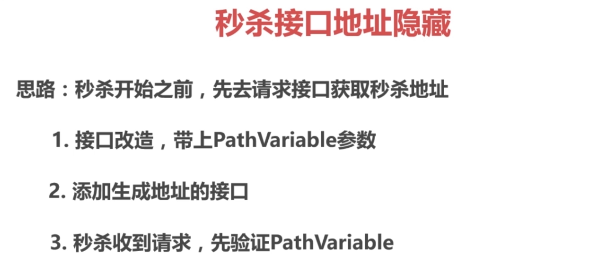
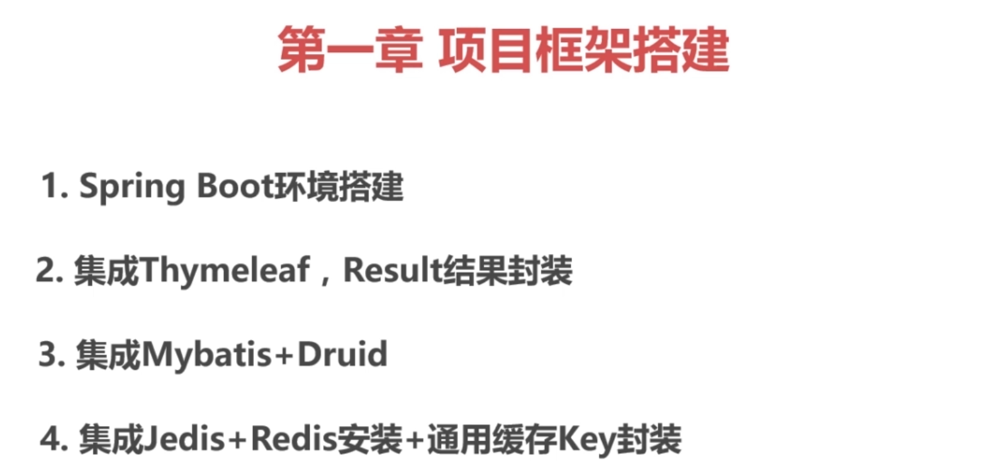
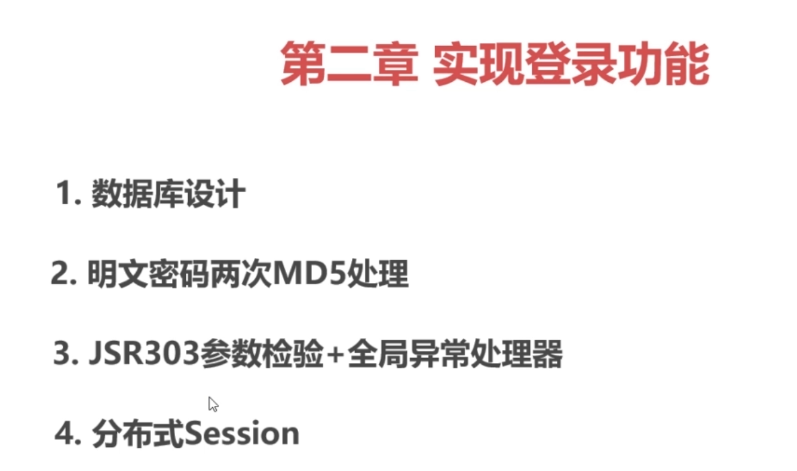
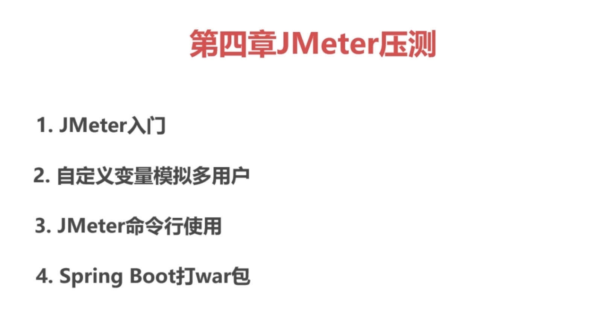
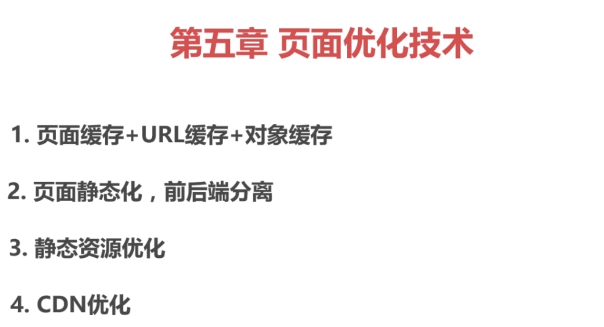
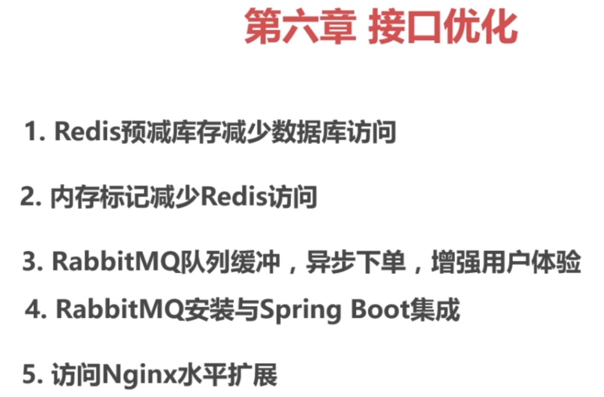

# 项目亮点

- 使用分布式 Session，可以实现让多台服务器同时可以响应
- 使用 redis 做缓存提高访问速度和并发量，减少数据库压力，利用内存标记减少 redis 的访问
- 使用页面静态化，加快用户访问速度，提高 QPS，缓存页面至浏览器，前后端分离降低服务器压力
- 使用消息队列完成异步下单，提升用户体验，削峰和降流
- 安全性优化：双重md5密码校验，秒杀接口地址的隐藏，接口限流防刷，数学公式验证码

# 秒杀流程

1. 用户登录，进入商品列表页面（静态资源缓存）
2. 点击进入商品详情页面（静态资源缓存，Ajax 获取验证码等动态信息）
3. 点击秒杀，将验证码结果和商品 ID 传给后端
  - 如果结果正确，动态生成随机串 UUID，结合用户 ID 和商品 ID 存入 redis，并将秒杀 path 传给前端；前端获取秒杀 path 后，再根据秒杀 path 地址调用秒杀服务
4. 服务端获取请求的 path 参数，去查缓存是否存在 path
5. 如果 path 存在且 redis 还有库存，则预减 redis 库存，检查是否已经生成订单，没有的话就将请求入消息队列
6. 从消息队列中取消息：获取商品 ID 和用户 ID，判断数据库库存，然后下单
7. 下单：数据库减库存，生成订单，将订单信息写入数据库和 redis
8. 前端轮询订单生成结果：可以继续轮询（间隔200ms）或者判断秒杀是否成功和失败

# 一. 环境的搭建

# 二. 登录功能的实现

## 主要内容

1. 数据库设计
2. 明文密码两次 MD5 处理
3. JSR303 参数检验 + 全局异常处理
4. 分布式 Session

## 数据库设计

1. 不做注册，直接登录，在 MySQL 中直接创建表
2. 用户表包括`id`、`nickname`、`password`、`salt`、头像、注册时间、上次登录时间、登录次数等字段

## 对登录密码进行两次MD5

> [细节描述：用Java实现对登录密码进行两次MD5加密](https://blog.csdn.net/weixin_41891177/article/details/107714412)

1. 两次MD5加密
   - 用户端：PASS = MD5（明文+固定salt）
   - 服务端：PASS = MD5（用户输入+随机salt）
1. 加密的目的：第一次是因为 http 是明文传输的，第二次为了防止数据库被盗

## JSR303参数检验

1. 通过对输入的参数`LoginVo`加注解`@validated`，然后在传入的参数`mobile`和`password`上加**注解判断**，如`@NotNull`判断是否为空，也可以自定义
2. 全局异常处理

## 分布式 Session

# 三. 实现秒杀功能

## 主要内容

1. 数据库设计
2. 商品列表页
3. 商品详情页
4. 订单详情页

## 数据库设计

- 包括商品表、订单信息表、秒杀商品表、秒杀商品订单表

## 商品列表页

- 为了展示秒杀商品的详情需要`goods`和`miaosha_goods`中的信息，所以封装一个`GoodsVo`，包括价格、库存、秒杀起始时间

## 商品详情页

## 订单详情页

- 这里也是秒杀功能的实现
- 在控制层先判断库存、然后判断订单是否存在、如果都没有就下单
- 下单顺序为减库存、下订单、写入秒杀订单

# 四. JMeter压测

## 主要内容

- JMeter入门
- 自定义变量模拟多个用户
- JMeter 命令行使用
- Redis 压测工具 redis-benchmark
- Spring Boot打war包

## JMeter入门

- JMeter 在 windows 下是图形界面
  1. 打开`jmeter.bat`运行图形界面
  2. 测试计划中添加线程组
  3. 在线程组中添加 HTTP 请求默认值（就是端口号）
  4. 在线程组中添加 HTTP 请求（就是要测试的类的 URL），这里可以设置带参数
  5. 在线程组中添加监听器进监听
  6. 也可以通过自定义模拟多用户（写一个测试文件，导入即可）
- JMeter 在 Linux 下为命令行操作
  1. 在 Windows 上录好`jmx`
  2. 命令行：`sh jmeter.sh -n -t XXX.jmx -l result.jtl`
  3. 把`result.jtl`导入到 jmeter
- 结果是`5000`并发的情况下，QPS为`1300`左右

## Redis压测工具redis-benchmark

- `redis-benchmark -h 127.0.0.1 -p 6379 -c 100 -n 100000`
  - `-c`为100个并发连接，`-n`为100000个请求
   Redis 的 QPS 在十万左右

# 五. 页面优化技术

## 内容

- 页面缓存 + URL缓存 + 对象缓存（缓存粒度：页面缓存 > URL缓存 > 对象缓存）
- 页面静态化（html 缓存在客户端，ajax 请求），前后端分离
- 静态资源优化
- CDN优化

## 页面缓存+URL缓存+对象缓存

- 秒杀的瓶颈在于数据库，所以要加上各种粒度的缓存，最大的是页面缓存、最小的是对象缓存
- **页面缓存步骤（这里指的是商品列表）**
  1. 从`redisService`中取缓存
  2. 若缓存中没有则手动渲染，利用 thymeleaf 模板
  3. 然后将页面加入缓存，并返回渲染页面
  4. 缓存有效时间不宜太长，设置为60s即可
- **URL缓存（指的是商品详情页）**
  1. 与页面缓存步骤基本一致，但是需要取缓存和加缓存时要加入参数，`GoodsId`
- **对象缓存（指的是 User 对象**）
  1. 前面的页面缓存和 URL 缓存适合变化不大的，缓存时间比较短
  2. 对象缓存是长期缓存，因此需要有个更新的步骤
  3. 第一步是取缓存
  4. 若缓存中没有则去数据库中查找，并加入缓存；如数据库中没有就报错
  5. 更新用户的密码
- 加缓存之后的QPS大概3000
- 需要先更新数据库，后删除缓存；顺序不能反，会导致数据不一致：若线程1先删除缓存，然后线程2读操作，发现缓存中没有，把数据库中的旧数据加入缓存，然后线程1更新数据库，就会导致缓存与数据库数据不一致

## 页面静态化，前后端分离

- 页面静态化无非就是使用纯html页面+ Ajax请求json数据后再填充页面
- 若A页面跳转到B页面之前需要条件判断，可以先在A页面中利用ajax请求判断后再跳转
- 如果不需要条件判断可以直接跳转到B的静态页面，让B自己用ajax请求数据

## 防超卖

- 发生在减库存的时候
- 解决方法是在Update语句中加一个判断

- 还有一种情况是一个用户同时发了两个请求，假如库存充足，且没有订单生成，那么就会减两次库存
- 解决办法是建立用户和商品的唯一索引
- 做到以上两点是不会发生超卖的（最后还是依靠数据库来实现数据一致）

## 静态资源优化

- JS/CSS压缩（去掉一些空格、注释等不必要的字符），减小流量，减小页面体积
- 多个JS/CSS组合，减小连接数（加载页面时如果需要加载多个JS/CSS，一般情况向服务器请求的并发数会很小，所以会和服务器建立多次连接；而TCP连接是三次握手，耗时较长；会导致首次加载页面时的加载速度较慢）
  - Tengine，淘宝开源项目；webpack，前端打包工具

- CDN（内容分发网络）就近访问

## CDN优化

- CDN 是内容分发网络，相当于缓存，只是部署在全国各地，当用户发起请求时，会找最近的 CDN 获取资源

##总结

- 并发大的瓶颈在于数据库，所以解决办法是加各种缓存：
  - 从浏览器开始，做页面的静态化，将静态页面缓存在浏览器中；
  - 请求到达网站之前可以部署一些CDN，让请求首先访问CDN；
  - 然后是页面缓存、URL缓存、对象缓存；
- 加缓存的缺点：数据可能不一致，只能做一个平衡

# 六. 接口优化

## 内容

- Redis 预减库存减少数据库访问
- 内存标记减少 Redis 访问
- RabbitMQ 队列缓冲，异步下单，增强用户体验（当某个业务执行时间过长，要增强其并发能力，可以采取异步的方式）
- RabbitMQ 安装与 SpringBoot 集成
- 访问 Nginx 水平扩展 / LVS / DNS轮询（注意：增加服务器来改善的前提是，不能把所有请求都落到 DB 上）
- 压测
- 还有一种方法：数据库的分表分库，阿里巴巴中间件 mycat

## 优化思路：减少数据库访问

1. 系统初始化，把商品库存数量加载到Redis中
2. 收到请求，Redis预减库存，库存不足，直接返回，否则进入3
3. 请求入队，立即返回排队中（异步下单）
4. 请求出队，生成订单，减少库存，把订单写入 Redis 中
5. 客户端轮询，判断是否秒杀成功

## 秒杀接口优化

- 之前的没有库存预热的步骤是：查库存 - 查订单 - 修改库存 - 生成订单
- **库存预热**：系统初始化时把库存加载到 redis 数据库
  - `MiaoshaController`继承`InitializingBean`，实现`afterPropertiesSet`方法即可
- 在上一步库存预热之后，执行步骤为：查 Redis 库存 - 判断是否存在订单 - 进入队列 - 在出队时才对数据库进行操作
- 这一步还可以有一个优化：**内存标记**
  - 使用一个`Map`，将商品 ID 设置为`false`，当售罄买完时，设为`true`
  - 然后每次不是直接访问 Redis 进行库存查询，而是先对商品 ID 进行条件判断，判断商品未卖完时才去访问 Redis
  - **内存标记的优点**：减少对Redis的访问（当商品已经卖完之后）

# 七. 安全优化

## 内容

- 秒杀接口地址隐藏
- 数学公式验证码
- 接口限流防刷

## 秒杀接口地址隐藏

- 虽然前端页面在秒杀未开始时秒杀按钮设置为不可用，但是有可能用户通过前端js代码找到秒杀地址在秒杀未开始时直接访问
- **秒杀接口隐藏的目的**是用户通过 js 获取到的秒杀地址并不能让其完成秒杀功能
- 在秒杀之前要先通过`Controller`中的`/path`路径下的类随机生成一个 path（MD5 + UUID），然后结合用户 ID和商品 ID 后存入 Redis，在执行秒杀的时候再从 Redis 中取 Path 进行验证，然后进行秒杀

## 数学公式验证码

- 作用：接口防刷；错开请求
- 在获取秒杀路径 path 之前，进行验证码校验

## 接口限流防刷

- 当一个用户访问接口时，把访问次数写入缓存，并设置有效期（假设为一分钟）
- 一分钟之内如果用户访问，则缓存中的访问次数加一；如果次数超限，则进行限流操作
- 如果一分钟内没有超限，缓存中的访问次数数据消失，下次再访问时重新将访问次数写入缓存

## 使用一个通用拦截器（接口限流防刷的具体实现）

- 可以用拦截器减少对业务侵入
- 首先写一个注解`AccessLimit`
- 每个类只需要加注解即可设置防刷次数
- 定义拦截器：继承`HandlerInterceptorAdapter`类
- 注册拦截器

# 八. 总结

> 问题总结（主要从三个方面：项目本身的问题、可能出现的问题、可改进的地方）

## 1.项目本身的问题

- 画一下项目的架构图
- 讲一下秒杀流程
- 秒杀模块怎么设计的
- 秒杀部分是怎么做的
- 分布式 Session 是怎么实现的
- 如何解决超卖？mysql锁
- 如何解决重复下单？mysql唯一索引
- 如何防刷？验证码+通用拦截器限流
- 消息队列的作用？异步削峰
- 压测没有？用什么压测？QPS是多少？
- 库存预减用的是哪个redis方法

## 2.可能出现的问题

- 缓存和数据库数据一致性如何保证？
- 如果项目中的redis服务挂掉，如何减轻数据库的压力
- 假如减了库存但用户没有支付，怎么将库存还原继续进行抢购

## 3.可改进的地方

- 系统瓶颈在哪？如何查找，如何再优化？
- 除了你项目里面的优化，你还有什么优化策略吗？（同上一个问题）

## 4.项目难点及问题解决

- 使用了大量缓存，那么就存在缓存击穿和缓存雪崩以及缓存一致性等问题
- 大量的使用缓存，对于缓存服务器也有很大的压力，如何减少redis的访问
- 在高并发请求的业务场景，大量请求来不及处理，甚至出现请求堆积的情况
- 怎么保证一个用户不能重复下单
- 怎么解决超卖现象
- 页面静态化的过程

# 补充

- 对于每次都要进行的参数验证（如检查user是否为空），可以写一个注释作为拦截器（如@NeedLoginIn）用于参数检验
- vo文件夹下的xxxVo类是结果封装类，用于组合不同类的信息
- 实际上只在一台云服务器上压测是不准的，因为服务器的进程不只有java文件，还有其他进程：mysql、rabbitmq、jmeter
  - 准确的做法是每个服务在单独的服务器上运行
- 利用 Nginx 横向扩展，负载均衡；Nginx 还可以做缓存
- LVS：应对高并发、高流量，负载均衡

