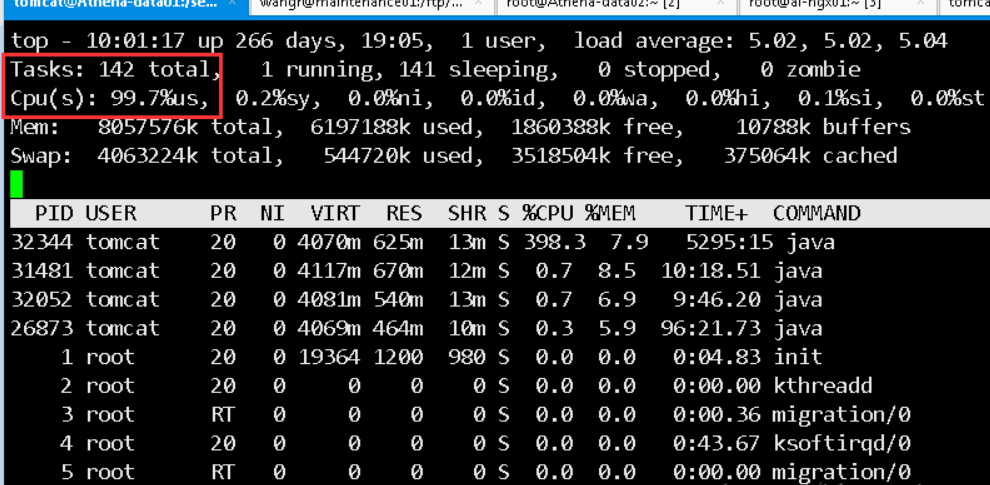
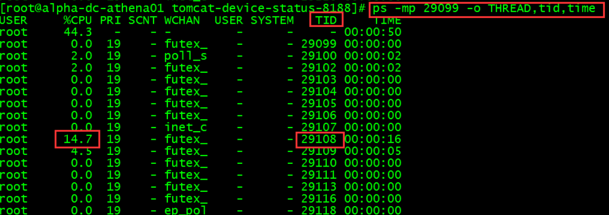
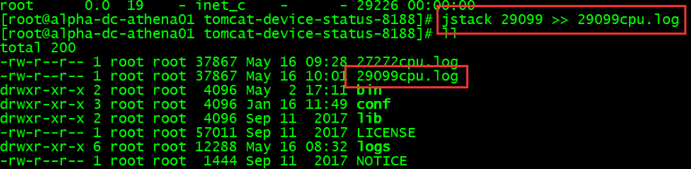
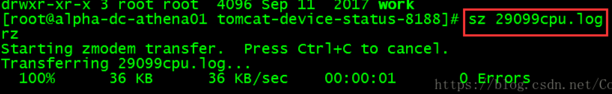
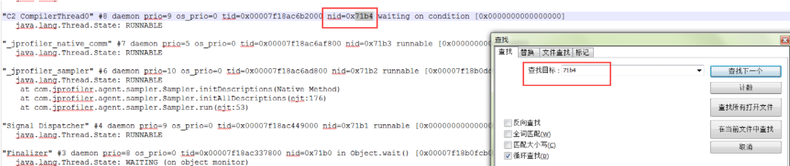

> 问题总结（主要从三个方面：项目本身的问题、可能出现的问题、可改进的地方）

# 1.项目本身的问题

## 画一下项目的架构图

## 讲一下秒杀流程

1. 用户登录，进入商品列表页面
2. 点击进入商品详情页面
3. 点击秒杀，将验证码结果和商品 ID 传给后端
   - 如果结果正确，动态生成随机串 UUID，结合用户 ID 和商品 ID 存入 redis，并将秒杀 path 传给前端；前端获取秒杀 path 后，再根据秒杀 path 地址调用秒杀服务
4. 服务端获取请求的 path 参数，去查缓存是否存在 path
5. 如果 path 存在且 redis 有库存，则预减 redis 库存，检查是否已经生成订单，没有的话就将请求入消息队列
6. 从消息队列中取消息：获取商品 ID 和用户 ID，判断数据库库存，然后下单
7. 下单：数据库减库存，生成订单，将订单信息写入数据库和 redis
8. 前端轮询订单生成结果

## 分布式 Session 的作用

- 问题：实际的项目会部署在多台服务器上，业务请求先后访问了不同的服务器，会导致之前的 Session 丢失
- 处理方式：
  - 方法一：使用原生的 Session，在多台服务器之间同步 Session，但实际应用使用较少，因为性能较低且实现复杂
  - 方法二：分布式 Session

## 分布式 Session 是怎么实现的

1. 用户登录后生成随机字符串（生成 UUID），并向 cookie 中写入此字符串
2. 在 Redis 中记录此字符串和用户信息的映射
3. 当用户再次访问网页时，取出 cookie 中对应字段值，根据此字段值访问 Redis 得到用户相关信息

## 如何解决超卖

> [高并发下防止库存超卖的解决方案](https://blog.csdn.net/yishihuakai/article/details/104581576)

- 主要依靠 MySQL 的乐观锁，在减库存时在 update 语句中添加库存判断：`where stock > 0`
- 利用唯一索引，防止重复下单
- **其他方法**
  - 利用 Redis 的单线程模型
    - 首先，redis是**单线程串行执行**的
       利用redis的单线程预减库存。比如商品有100件。那么我在redis存储一个k,v。例如 <gs1001, 100>
       每一个用户线程进来，key值就减1，等减到0的时候，全部拒绝剩下的请求。
       那么也就是只有100个线程会进入到后续操作。所以一定不会出现超卖的现象
  - MySQL 的悲观锁，`select...for update`；效率低
  - Redis 分布式锁
  - Redis 原子操作

## 如何解决重复下单

- 执行扣减库存下订单之前，查询 redis 判断是否有用户秒杀此商品的订单
- 利用唯一索引，在订单表中创建用户 ID 和 商品 ID 组成的唯一索引，这样在重复插入数据时会插入失败，之前的减库存操作在事务也会回滚

## 如何防刷

- 数学公式验证码
- 通用拦截器限流，记录用户在一段时间内对该接口的访问次数，如果超过设定值就直接返回“请求频繁”，进行限流

## 消息队列的作用

- 流量削峰，减小同一时刻并发量
- 实现异步下单，入队之后直接返回用户排队中的消息，提高用户体验

## 如何通知相应用户秒杀成功

- 项目的做法是：客户端轮询下单情况
- 优化做法：服务端异步通知（WebSocket）
  - webSocket 实现后台向前端推送信息
  - WebSocket 可以实现客户端和服务器端的长连接，双向实时通信
  - 缺点：尽管WebSocket有诸多优点，但是，如果服务端维护很多长连接也是挺耗费资源的，服务器集群以及览器或者客户端兼容性问题，也会带来了一些不确定性因素
  - 大体了解了一下各大厂的做法，大多数都还是基于轮询的方式实现的，比如：腾讯PC端微信扫码登录、京东商城支付成功通知等等

## 压测 / QPS

- JMeter 压测
- 10个线程，每个线程每秒5000并发量
- 云服务器，性能太差（1核2G）
- 虚拟机4核4G，未优化前：1100~1200QPS，优化后：2000QPS

## 库存预减用的是哪个redis方法

- 使用 Jedis 封装的方法，减库存使用`decr`方法

- 减库存`decr`方法的原理：redis的`incr`和`decr` 可以实现原子性的递增递减

	
jedis中对整数和浮点数操作

	<table border="1">
    	<tr>
    		<td>jedis.decr(String key) </td>
    		<td>将key对应的value 减1</td>
    	</tr>
    	<tr>
    		<td>jedis.decrBy(String key , int n) </td>
    		<td>将key对应的value 减 n</td>
        </tr>
        <tr>
            <td> jedis.incr(String key)</td>
            <td>将key对应的value 加1</td>
        </tr>
        <tr>
            <td>jedis.incrBy(String key,int n)</td>
            <td>将key对应的value 加 n</td>
        </tr>
  	</table>

## 如何保证秒杀公平性

- 消息的可靠性传输可以保证秒杀业务的公平性
- 消息的顺序性（先进入队列的消息先进行处理）

# 2.可能出现的问题

## 缓存和数据库数据一致性如何保证?

### 先更新数据库，再删除缓存

- Cache Aside Pattern（旁路缓存模式）
- 如果更新数据库成功，而删除缓存这一步失败，该怎么做？**消息队列 + 异步重试**
  - 把要删除缓存值操作生成消息，暂存到消息队列中
  - 当删除缓存值或者是更新数据库值操作成功时，把这些消息从消息队列中去除（丢弃），以免重复操作
  - 当删除缓存值失败时，重试服务从消息队列中重新读取（消费）这些消息，然后再次进行删除或更新
  - 删除或者更新失败时，需要再次进行重试，重试超过的一定次数，向业务层发送报错信息
- 如果更新数据库成功，而删除缓存这一步失败，该怎么做？**订阅数据库变更日志，再操作缓存**
  - 拿 MySQL 举例，当一条数据发生修改时，MySQL 就会产生一条变更日志（Binlog），我们可以订阅这个日志，拿到具体操作的数据，然后再根据这条数据，删除对应的缓存
  - 直接投递到MQ，使用MQ异步去删除对应的缓存
  - 订阅变更日志，目前也有了比较成熟的开源中间件，例如阿里的 canal，使用这种方案的优点在于：
    - **无需考虑写消息队列失败情况**：只要写 MySQL 成功，Binlog 肯定会有
    - **自动投递到下游队列**：canal 自动把数据库变更日志「投递」给下游的消息队列

### 先删除缓存，再更新数据库

- 在「并发」场景下依旧有数据不一致问题，**延时双删**

### 更新数据库 + 更新缓存方案

- 在「并发」场景下无法保证缓存和数据一致性，且存在「缓存资源浪费」和「机器性能浪费」的情况发生

## 保证缓存和DB强一致

- Redis 分布式锁

## 如果项目中的redis服务挂掉，如何减轻数据库的压力

- 设置本地缓存，用缓存顶住大量的查询请求
- 主从数据库，主数据库负责写，从数据库负责读
- 设置限流降级功能
- 做好参数校验

## 假如减了库存但用户没有支付，怎么将库存还原继续进行抢购

- 订单超时未支付则删除订单，增加库存数量，恢复 Redis 缓存和本地缓存的数量

# 3.可改进的地方

## 系统瓶颈 / 如何查找 / 如何再优化

- 系统瓶颈
  - 数据库
  - 服务端网络带宽，服务器的 CPU、内存等硬件资源
- 如何查找：通过查看服务器运行时的资源占用情况判断（`top`命令）
- 再优化
  - 对于服务端网络带宽可以向 ISP 购买，增加服务器硬件资源
  - 减小耗费 CPU 和内存的操作，避免创建大对象的操作，防止出现内存泄漏
  - CDN，动静态资源分离
  - Nginx，LVS

## 项目可改进之处

- 对于数据的动静态资源分离没有做彻底，只使用到了浏览器缓存，没有使用 CDN 等技术
- 没有设置服务降级的方案
- 限流做的还不够完善，项目里只是对用户对于某个商品的访问做了限流，没有对整体的流量做限流
- 没有考虑 redis 穿透的情况处理方案（使用布隆过滤器）
- 项目是对秒杀商品的库存和静态数据进行了预热，但实际中某些非秒杀商品可能在某时间段的访问量剧增，如果没有对这些商品数据进行预热可能会使服务宕掉，**需要进行热点数据的快速发现和隔离**

# 4.项目难点及问题解决

## 缓存击穿、缓存雪崩、缓存穿透、缓存一致性

> 使用了大量缓存，那么就存在缓存击穿、缓存雪崩、缓存穿透以及缓存一致性等问题

- **缓存击穿**：某个热点的 key 突然失效了，对其的大并发集中访问全部落在数据库上，导致数据库压力剧增
  1. 针对热点 key 失效：对于热点的 key 设置永不过期的 key
  2. 针对大并发访问：使用互斥锁。如果缓存失效，只有拿到锁才能查询数据库，降低同一时刻落在数据库上的请求；代价是导致系统的性能变差
- **缓存雪崩**：某一时刻出现大规模的 key 失效，大量请求直接落在数据库上，导致数据库压力剧增
  1. 针对 Redis 服务不可用
     - 搭建 Redis 集群，提高 Redis 的容灾性
     - 限流，避免同时处理大量的请求
     - 熔断机制，当流量达到一定阈值时，直接返回“系统拥挤”之类的提示
  2. 针对同一时刻的大规模缓存失效
     - 设置不同的失效时间，在原有的失效时间上加上随机值
     - 对热点 key 设置永不过期
     - 使用互斥锁，当缓存数据失效时，保证只有一个请求能够访问到数据库，并更新缓存，其他线程等待并重试
- **缓存穿透**：大量请求的 key 不存在于缓存中，导致大量请求直接落在数据库上，根本没有经过缓存
  1. 做好参数校验，对于非法的参数请求直接抛出异常信息返回客户端
  2. 把无效的 key 存入缓存并设置过期时间，适用于请求的 key 变化不频繁的情况，**缺点**是如果请求的无效 key 每次都是随机的，会导致 Redis 中缓存大量无效的 key
  3. **在查询缓存之前使用布隆过滤器**。布隆过滤器判断某个 key 不存在，那么一定不存在；布隆过滤器判断某个 key 存在，则大概率存在（小概率误判，因为不同元素可能哈希出来的位置相同）
     - 降低布隆过滤器的误判概率：适当增加位数组的大小；调整哈希函数
- **保证缓存和数据库数据的一致性**
  1. 先更新数据库，再删除缓存
  2. 如果更新数据库成功，但删除缓存这一步失败的解决方案
    - 消息队列+异步重试
    - 订阅binlog

## 如何减少redis访问

> 大量的使用缓存，对于缓存服务器也有很大的压力，如何减少redis的访问？

- 使用内存标记，利用`HashMap`，未卖完时，把商品 ID 设置为`false`；卖完时，设置为`true`
- 每次查询库存不是直接访问 Redis，而是先进行条件判断

## 如何解决请求堆积

> 在高并发请求的业务场景，大量请求来不及处理，甚至出现请求堆积的情况

1. 增加更多的消费者，提高消费速度
2. 给消费者开启线程池，提高消费速度
3. 利用惰性队列 Lazy Queues，扩大队列容积，提高堆积的上限

## 页面静态化的过程

- 使用纯 html 页面，Ajax 动态请求 JSON 数据填充页面

## 秒杀接口隐藏的过程

- 用户点击秒杀按钮时向服务器请求秒杀路径
- 服务器生成随机 path，结合用户 ID 和商品 ID 之后存入 Redis
- 前端获取到秒杀路径后，根据秒杀路径调用秒杀服务
- 服务器根据用户 ID 和 商品 ID 查询 Redis，判断秒杀路径是否一致

## 排查CPU占用过高的方法

1. 先用`top`命令，找出 CPU 占用最高的进程 PID

   

2. `ps -mp pid号 -o THREAD,tid,time`，查询这个进程中哪个线程的 CPU 占用率高，记住它的 TID

   

3. 用`jstack`命令打印这个线程的日志，`jstack TID号 >> xxx.log`

   

4. 将日志文件下载到本地，`sz xxx.log`

   

5. 将查找到的线程占用高的 TID 转成16进制

6. 打开下载好的`xxx.log`，通过查找方式找到对应的线程进行排查

   

